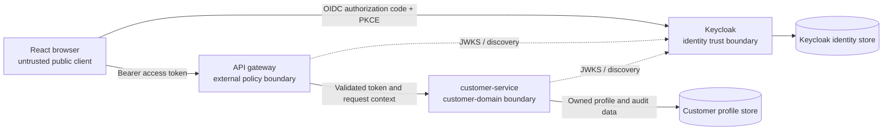

# ADR-005: Use Keycloak for identity and RBAC

## Status

Accepted — PostgreSQL, Keycloak, and customer-service are deployed and healthy in the PoC. Realm import, roles, clients, security defaults, PKCE policy, event recording, and least-privilege activity-reader access are implemented and live-validated. React and API Gateway integrations exist in source but are not deployed, and the end-to-end identity journey has not been validated.

## Context

Customer registration, secure authentication, password management, customer profiles, addresses, role-based access, audit history, and customer activity are one user-facing capability but cross two different security and data-ownership boundaries. Authentication and credential handling require a specialized identity provider. Customer profiles and addresses are business records whose lifecycle and authorization rules belong to the customer domain.

Combining these responsibilities in `customer-service` would create bespoke credential code, enlarge the impact of a customer-domain compromise, and couple profile changes to security-sensitive identity operations. Conversely, placing business profiles and addresses in Keycloak would turn identity attributes into an ungoverned domain database and weaken service ownership.

## Decision

Use Keycloak as the OpenID Connect identity provider and authorization identity source.

Keycloak owns:

- registration identity, authentication, credentials, password policies, credential recovery, token issuance, login/logout, identity roles, sessions, and authentication events;
- the canonical external user identifier exposed as the JWT `sub` claim; and
- identity-administration operations, which must not be exposed through ordinary customer APIs.

`customer-service` owns:

- the customer business profile and an internal customer profile identifier;
- customer address records and account-domain metadata;
- audit history for customer-domain changes; and
- a safe customer activity presentation assembled from authorized customer-domain events and selected Keycloak authentication-event data.

The service must never store plaintext passwords, password hashes, password reset tokens, recovery answers, one-time credentials, or Keycloak client secrets intended for confidential clients.

### Trust boundaries

The browser is an untrusted public client. Keycloak is the credential and session trust boundary. The API gateway is the external API policy enforcement point. Each backend service is a separate resource-server trust boundary and must not rely solely on the gateway. PostgreSQL-backed customer data and Keycloak identity data are separate protected data boundaries. Administrative Keycloak endpoints are platform-management interfaces and are not customer-facing routes.

### React to Keycloak authentication flow

1. React initiates the OpenID Connect Authorization Code flow with PKCE and redirects the browser to Keycloak. The SPA is a public client and has no client secret.
2. Keycloak performs registration, login, password recovery, password policy checks, and any configured authentication controls on Keycloak-hosted screens.
3. Keycloak redirects only to an allow-listed URI with an authorization code. React exchanges the code using the PKCE verifier.
4. React uses the access token for APIs and treats UI role checks as presentation only, never as an authorization control. Token storage must minimize exposure; long-lived tokens must not be persisted in browser local storage.
5. Logout is initiated through the OpenID Connect logout flow so the Keycloak session is terminated. Local UI state is then cleared.

Self-registration creates the Keycloak identity first. Customer-profile provisioning is a separate idempotent operation correlated by `sub`. The implemented customer-service endpoint is `PUT /api/v1/customers/me`: verified identity claims seed the first profile, while an atomic database insert-or-read operation and unique constraint make retries and concurrent requests converge on one profile. Only the winning insert creates the `profile.provisioned` domain audit event. An identity may temporarily exist without a profile until this endpoint is called.

### React to customer-service API flow

1. React sends the access token to a versioned gateway route using the `Authorization: Bearer` header.
2. The implemented gateway applies fixed-route forwarding, bounded timeouts, correlation identifiers, and safe transport errors while propagating the bearer token without logging it. Gateway JWT validation, rate limits, and request-size policy remain production-facing gaps.
3. The gateway forwards the request through an authenticated internal route. It must not convert user-supplied identity headers into trusted identity.
4. `customer-service` independently validates the token and performs resource-level authorization using the verified subject and roles.
5. For self-service operations, the service derives ownership from the verified `sub` mapping. It must not authorize a profile merely because the caller supplied its identifier.

### JWT validation

`customer-service` acts as the implemented OAuth 2.0 resource server. It validates the signature with Keycloak's published, cached JWKS and verifies the expected issuer, intended audience, permitted algorithm, expiry, and required claims. Validation fails closed for malformed or unverifiable tokens. JWKS caching supports bounded refresh for signing-key rotation without accepting arbitrary keys. Clock skew is narrowly bounded, and tokens are never written to application logs. Gateway-side JWT validation is not implemented and must not be claimed as an active control.

Gateway validation provides early rejection but does not replace service validation. Internal network location is not proof of end-user identity. Any trusted internal identity context must be integrity-protected and derived only from the validated token.

### Role-based and resource-level authorization

Keycloak supplies governed realm or client roles. The implemented realm roles are `customer`, `support`, and `operations_admin`; self-registration receives `customer` by default. Customer-service implements customer self-service ownership, support read-only access, and explicit operations-administrator status changes. React uses roles only to shape navigation and routes. API Gateway forwards registered routes but does not currently enforce roles. Service-side automated tests exist, but their execution did not complete during the current documentation review.

RBAC alone is insufficient for customer records. `customer-service` also enforces object ownership and permitted fields. A customer may access only the profile associated with their verified `sub`; support or administrative access requires an explicit role and a documented business rule. Server-side checks prevent insecure direct object reference (IDOR), including when valid profile or address UUIDs are guessed.

### Identity and profile relationship

Keycloak's immutable user identifier (`sub`) is stored in the customer profile as a unique external identity reference. The customer profile retains its own opaque internal UUID for domain relationships. The mapping is one-to-one for the initial capability, is never inferred from email, and is protected by a unique constraint. Email and username can change and therefore are not stable join keys.

Identity creation does not imply successful profile creation. Provisioning uses an idempotency rule around `sub`; reconciliation detects missing or orphaned mappings. Identity merges, account deletion, anonymization, and re-linking require privileged, auditable workflows and are not ordinary profile updates.

### Audit and authentication events

`customer-service` records append-oriented domain audit events for security-relevant profile, address, account-status, and administrative changes. Each event includes a UTC timestamp, action, outcome, verified actor subject, target profile identifier, correlation/trace identifier, source component, and a safe change summary. It excludes credentials, tokens, secrets, and unnecessary personal values. Audit access is separately authorized, retention-governed, and protected against ordinary customer modification.

Keycloak remains the source of authentication events such as registration, login success/failure, logout, credential reset, session activity, and administrative identity changes. Event recording is enabled with finite PoC retention and administrative event details disabled. The implemented PoC activity adapter queries selected real events through a dedicated confidential service account with only `realm-management/view-events`, then maps an allow-listed subset to a stable response model. It preserves provenance and event time, excludes credentials, raw tokens, session identifiers, IP addresses, and raw details, and does not become the authentication system of record.

Operational logs support diagnosis and correlation; domain audit records support accountability; Keycloak events describe identity activity. These records have different access, integrity, and retention requirements and must not be treated as interchangeable.

## Alternatives considered

- Custom authentication: unacceptable security risk and unnecessary scope.
- Cloud Identity Platform: managed, but less portable and less suitable for a self-contained kind demonstration.
- Direct LDAP integration: enterprise-relevant but adds directory dependencies and does not itself provide the required application token flows.
- Store profiles as Keycloak user attributes: reduces components, but makes Keycloak a business data store, weakens customer-domain ownership, and complicates address and audit lifecycles.
- Validate JWTs only at the gateway: simpler, but creates excessive trust in network routing and leaves services vulnerable to bypass or gateway misconfiguration.
- Use email as the cross-system key: human-readable, but mutable, reusable, and unsuitable as a stable security identifier.

## Consequences

Identity concerns are centralized and standards-based while business data remains in its owning domain. Keycloak introduces operational state, configuration lifecycle, signing-key rotation, and availability dependencies. `customer-service` requires explicit identity-to-profile provisioning, reconciliation, and resource-level policy. RBAC must be combined with ownership checks, and authentication activity must be integrated without confusing it with domain audit history.

## Security implications

Credentials are excluded from `customer-service` because a dedicated provider supplies hardened password storage, policy enforcement, recovery, brute-force controls, session handling, and protocol implementation. This reduces credential exposure and prevents profile APIs, logs, backups, or database access from disclosing passwords. It does not eliminate the need to secure Keycloak and its administrative plane.

Threat treatment includes:

| Threat | Required treatment |
| --- | --- |
| Stolen tokens | TLS, short-lived access tokens, minimal browser persistence, strict issuer/audience validation, session termination, key rotation, and no token logging. |
| Excessive role privileges | Deny-by-default role design, least privilege, separation of customer/support/administrative duties, protected role administration, periodic access review, and negative authorization tests. |
| Password attacks and brute force | Keycloak password policy, rate limiting, brute-force detection/lockout, safe recovery, generic failure messages, and MFA in the production evolution. |
| Credential leakage | Keycloak-hosted credential flows, no passwords in customer-service, no secrets in Git or logs, protected secret delivery, encryption in transit, and restricted administrative access. |
| Unauthorized profile access | Service-side subject-to-profile mapping, field-level policy where required, authenticated internal paths, audit records, and deny-by-default decisions. |
| IDOR | Never trust a caller-supplied profile or address ID as proof of ownership; resolve and verify ownership from the validated `sub` for every object operation. |

Authentication and audit telemetry can contain personal or security-sensitive metadata. Collection must be proportionate, access-controlled, redacted, retention-limited, and consistent with applicable privacy obligations.

## PoC limitations

The PoC uses one Keycloak pod, one PostgreSQL pod, and one customer-service pod on the single-node kind cluster on one physical GCP VM. This topology has no host-level high availability. The `shopsphere` realm, public frontend client, API audience, service-integration client, roles, password policy, brute-force controls, bounded tokens and sessions, refresh-token rotation, event recording, PostgreSQL persistence, and internal ClusterIP services are implemented. Local HTTP and loopback URLs are PoC constraints, not production transport controls.

Customer-service JWT validation, profile provisioning, resource authorization, customer-domain audit storage, normalized activity APIs, activity adapter, runtime Secret references, and Kubernetes workload are implemented. React authentication/customer screens and API Gateway customer routing are also implemented in source. Live checks validate the Keycloak and deployment configuration, but the retained live integration report contains seven skips and the customer-service test run did not complete in this review. No browser-to-service journey is claimed as functionally validated. Public ingress, gateway JWT enforcement, SMTP-backed recovery, verified email, MFA, federation, automated credential rotation, durable event export, and enterprise lifecycle reconciliation remain outstanding.

## Production evolution

Use a supported highly available Keycloak deployment or evaluated managed identity service, an external resilient database, private administrative access, enterprise federation, phishing-resistant MFA, risk-aware authentication, automated provisioning/deprovisioning, signing-key and secret rotation, tested backups, monitored event export, and formally governed authorization. Add token revocation/introspection where risk requires it, fine-grained policy where RBAC plus ownership is insufficient, immutable audit storage, privacy-governed retention, reconciliation alerts, and tested identity disaster recovery.

## Viva defence notes

Differentiate authentication from authorization: Keycloak proves an identity and issues role claims; the gateway rejects invalid external requests; `customer-service` decides whether that verified actor may operate on a specific customer resource. Explain why `sub`, not email, links identity to profile. Distinguish Keycloak authentication events, customer-domain audit history, and operational logs. Emphasize that excluding credentials from domain services reduces risk and avoids bespoke identity code, while the single-instance PoC remains explicitly non-high-availability.
