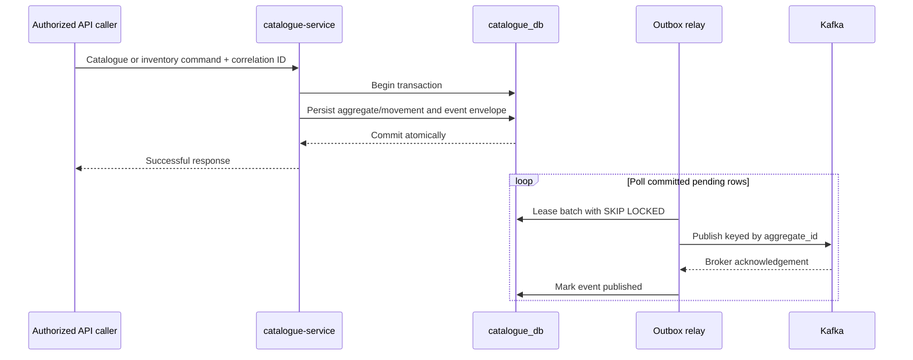

# Catalogue and Inventory Event Publication

ShopSphere publishes committed Catalogue and Inventory facts through Apache Kafka using a PostgreSQL transactional outbox. The implementation is deliberately producer-only: no unrelated service consumer is introduced.

## Commit and relay sequence

The aggregate change and event intent succeed or roll back together. Kafka I/O never occurs inside the domain transaction. If Kafka is unavailable, the API write remains valid and the committed outbox row is retried. Catalogue readiness continues to reflect authoritative PostgreSQL connectivity; Kafka is an asynchronous dependency.

## Versioned envelope and topics

Every message contains `event_id`, `event_type`, `event_version`, `aggregate_type`, `aggregate_id`, UTC `occurred_at`, `correlation_id`, `producer`, and an event-specific `payload`. The topic equals `event_type`. Payloads contain minimal product, price, balance, threshold, and movement projections; they exclude credentials, passwords, JWTs, refresh tokens, secrets, and unnecessary personal data.

| Topic | Trigger |
| --- | --- |
| `catalogue.product.created.v1` | Product registration commits |
| `catalogue.product.updated.v1` | Product metadata/lifecycle update commits |
| `catalogue.price.changed.v1` | A new effective price commits |
| `inventory.adjusted.v1` | Initial stock or a stock adjustment and movement commit |
| `inventory.low.v1` | Availability transitions into low stock |
| `inventory.out-of-stock.v1` | Availability transitions to zero |
| `inventory.reserved.v1` | An active reservation and reserved balance commit |
| `inventory.reservation_released.v1` | An active reservation is released idempotently |
| `inventory.reservation_consumed.v1` | Reserved allocation is finalized into on-hand consumption |

Reservation payloads contain the reservation/product/inventory identifiers, quantity,
state, resulting balances, movement identifier, location and version. They intentionally
exclude the external order-workflow reference to minimize cross-boundary data exposure.
The three reservation topics are represented in source and topic-reconciliation scripts;
their live creation/publication remains Pending / Not Verified.

Contract changes that are not backward compatible require a new topic/version. Consumers must reject unknown required versions safely and must not infer authorization from an event.

## Delivery and ordering semantics

Delivery is **at least once**. The producer enables Kafka idempotence for broker-level retries, but an event can still be duplicated if Kafka accepts it and the relay fails before marking its outbox row published. Consumers must deduplicate by immutable `event_id` and make side effects idempotent.

The relay leases rows with PostgreSQL `FOR UPDATE SKIP LOCKED`, uses a bounded batch, releases failures for retry, and records only a safe error code. A crashed relay leaves leases eligible after expiry. Events are selected by occurrence time and keyed by `aggregate_id`; the one-partition PoC preserves order within each topic. There is no guaranteed order across topics, and future multi-partition topics preserve order only per aggregate key. Published outbox rows are retained for current evidence; production needs governed cleanup/archival and lag monitoring.

## PoC security and availability limits

Kafka 4.3.1 runs as one combined KRaft broker/controller on the same kind node and physical VM as the application. Its Services are ClusterIP/headless only, its listener is not publicly mapped, auto topic creation is disabled, and a NetworkPolicy limits declared ingress. NetworkPolicy enforcement depends on the installed CNI.

The private PoC listener is plaintext and has no authentication or ACLs. The single retained PVC improves pod-restart survival but is not replication, backup, disaster recovery, or high availability. Loss of the node, VM, cluster, volume, broker, or controller can interrupt or lose Kafka data.

## Production evolution

Use managed Kafka where operationally appropriate, or at least three dedicated brokers/controllers across zones with replication factor three, rack/zone awareness, durable encrypted storage, tested recovery, quotas, TLS, workload authentication, least-privilege ACLs, private connectivity, and separate administrative access. Add broker health, under-replicated partition, storage, producer-error, outbox-age, retry, and consumer-lag monitoring. Govern schemas and compatibility in a registry, define retention/data classification, automate topic policy, and establish replay and dead-letter procedures. Consumers remain independently idempotent even with stronger broker guarantees.
