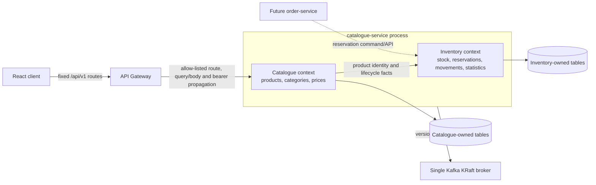

# Product Catalogue and Inventory Domain Design

## Status and evidence boundary

This document defines the domain model for Product Catalogue and Inventory Management. Catalogue categories, products, immediate effective pricing, PostgreSQL search, inventory balances, derived availability, stock adjustments, controlled inventory reservations, append-only movement history, calculated statistics, optional Redis cache-aside reads, SQLAlchemy repositories, Alembic migrations, JWT/RBAC enforcement, internal service APIs, a transactional event outbox, Kafka production, explicit public API Gateway transport routes, React catalogue/inventory screens, and internal Kubernetes workloads are implemented. The isolated backend suite includes reservation concurrency, idempotency, authorization, cache and outbox tests. The reservation migration, dedicated order-service identity, live reserve/release flow and Order checkout integration are Platform Validated. Earlier catalogue browser evidence predates reservations, and no browser directly exercises the internal reservation API.

The design is governed by [ADR-001](../adr/ADR-001-modular-microservices-architecture.md), [ADR-004](../adr/ADR-004-fastapi-versioned-rest-apis.md), [ADR-005](../adr/ADR-005-keycloak-identity-rbac.md), [ADR-006](../adr/ADR-006-postgresql-redis-data-platform.md), [ADR-007](../adr/ADR-007-kafka-domain-events.md), and [ADR-010](../adr/ADR-010-utc-timestamps-json-logs.md).

## Bounded contexts and ownership

The PoC keeps two logical bounded contexts in one deployable `catalogue-service`. They must remain separate modules with explicit application interfaces and must not share mutable domain objects.



| Context | Owns | Does not own |
| --- | --- | --- |
| Catalogue | Product metadata and lifecycle; category hierarchy and assignments; currency-specific price history | Physical/reserved stock, orders, credentials, customer data |
| Inventory | Stock balances, derived availability, stock adjustments, reservation state, immutable movement history, inventory statistics | Product descriptions/categories/prices, order lifecycle, identity roles |

Catalogue may expose a composed read model containing product, current price, and availability. Composition does not transfer source-of-truth ownership. Neither context may read another service's database directly.

## Implemented domain model

All domain identifiers are UUIDs. All stored instants are timezone-aware UTC values. Human-readable codes are alternate keys, not primary keys.

### Product

The Product aggregate owns:

- `id`: immutable UUID;
- `sku`: normalized, immutable business identifier with a database uniqueness constraint;
- `name` and validated descriptive metadata;
- `status`: `draft`, `active`, `inactive`, or `discontinued`;
- one required category assignment; and
- `created_at` and `updated_at` UTC timestamps.

SKU comparison is case-insensitive after one documented normalization rule, such as trimming and upper-casing. A SKU cannot be silently reused after discontinuation. Changing an entered SKU requires an explicit governed correction workflow because external systems may retain it.

Only `active` products appear in ordinary customer search and detail results. `draft` is editable but unpublished; `inactive` is temporarily unavailable for sale; `discontinued` is terminal for ordinary operations. Lifecycle changes do not delete price, inventory, or movement history.

### ProductCategory

The ProductCategory aggregate owns an immutable UUID, unique normalized slug, display name, optional description, status, optional `parent_id`, and UTC timestamps. An adjacency-list relationship supports a hierarchy while keeping the model understandable for the PoC.

Category invariants are:

- a category cannot parent itself or one of its descendants;
- sibling/display ordering is presentation metadata, not identity;
- deletion is rejected while products or child categories reference the category; use deactivation or an explicit reassignment transaction; and
- product-to-category assignment is many-to-many, represented by a persistence association rather than ownership of the Product itself.

### ProductPrice

ProductPrice is an effective-dated value record with its own UUID, `product_id`, ISO 4217 three-letter `currency_code`, exact decimal `amount`, `effective_from`, optional `effective_to`, actor/correlation metadata, and UTC creation timestamp.

Money uses `Decimal` in Python and PostgreSQL `NUMERIC(19,4)`; binary floating point is prohibited. Amounts must be positive. The PoC supports an immediately effective price per product/currency: setting a price closes the prior active row and appends a new active row. Currency-specific display rounding remains separate from stored precision.

### InventoryItem

InventoryItem is the consistency aggregate for one product at one inventory location. The PoC may use a single governed `location_code`, but the data model retains that dimension so production warehouses do not require redefining identity. Its fields are:

- `id`, `product_id`, and `location_code`, unique as a pair;
- non-negative integer `quantity_on_hand`;
- non-negative integer `quantity_reserved`;
- a concurrency `version`; and
- UTC creation/update timestamps.

`quantity_available` is a calculated value:

```text
quantity_available = quantity_on_hand - quantity_reserved
```

It is never accepted as an independently editable input. The database and domain layer enforce `quantity_reserved <= quantity_on_hand`, so available quantity cannot be negative. Fractional units are outside the PoC assumption; supporting weighted products later requires a governed unit-of-measure model and decimal quantity policy.

### InventoryMovement

InventoryMovement is an append-only fact created for every accepted stock or reservation change. It contains an immutable UUID, `inventory_item_id`, movement type, signed `on_hand_delta`, signed `reserved_delta`, resulting balances, reason code, safe reference, actor subject/service identity, correlation ID, idempotency key, and UTC `occurred_at`.

Administrative adjustment commands use `INITIAL_STOCK`, `STOCK_RECEIPT`, `MANUAL_ADJUSTMENT`, `DAMAGE`, and `CORRECTION`. They cannot submit reservation lifecycle types through the generic adjustment API. The internal reservation application exclusively creates `RESERVATION`, `RELEASE`, and `FULFILMENT` movements. Free-text reasons are constrained and must not contain credentials, tokens, or unnecessary personal data. Update and delete operations on movement rows are prohibited at the repository and database layers. Corrections create compensating movements.

### InventoryReservation

InventoryReservation represents an inventory-owned allocation, not an Order aggregate. It
stores a UUID, InventoryItem/product references, positive quantity, globally unique opaque
external workflow reference, `ACTIVE`/`RELEASED`/`CONSUMED` status, optional future expiry,
and UTC timestamps. A matching external reference is an idempotent replay; reuse with a
different product, quantity, or expiry conflicts. Expiry is stored for evolution but no
automatic expiry worker is implemented.

Reserve increases only `quantity_reserved`; release decreases it; consume decreases both
on-hand and reserved quantities. Every transition creates an immutable movement and
transactional outbox facts. Consumption finalizes inventory allocation accounting and is
not evidence of packing, shipment, delivery, or payment.

## Aggregate invariants and transaction rules

1. Product UUID and normalized SKU are unique; SKU is the external business key but not the database primary key.
2. Category graphs are acyclic, and inactive categories cannot receive new product assignments.
3. Price amount and currency are valid, and effective periods do not overlap for a product/currency pair.
4. Inventory balances are integers satisfying `on_hand >= 0`, `reserved >= 0`, and `reserved <= on_hand`.
5. Every accepted balance change and its InventoryMovement are committed in the same PostgreSQL transaction.
6. Commands carry an idempotency key unique within the inventory boundary so retries do not double-apply stock.
7. Movement history is immutable; catalogue and inventory records use UTC timestamps and UUID identifiers.
8. Products cannot be made customer-visible without an active lifecycle state. Availability does not imply sellability when the product is inactive or lacks a current price.
9. A new reservation requires an active/searchable product and sufficient locked PostgreSQL availability; Redis never participates in the decision.
10. Reservation external references are unique, lifecycle transitions are conservative, and released/consumed quantities cannot be applied twice.

## Concurrency and consistency

Inventory is a contention point. A read-then-write sequence without locking can lose updates. The implemented repository operation executes one database transaction that:

1. validates the globally unique movement idempotency key;
2. locks the InventoryItem row with `SELECT ... FOR UPDATE` and applies a version-checked atomic update;
3. checks the proposed balances against database constraints;
4. updates the balances and version; and
5. inserts the corresponding immutable movement before commit.

Constraint or version conflicts become a stable `409 Conflict`; validation failures become `422` or a governed `400` response. The current implementation does not retry deadlocks or serialization failures; production evolution must add bounded retries with structured, token-free logs. Multi-item reservations will require deterministic lock ordering. Current statistics are calculated directly from authoritative balances rather than an eventually consistent projection.

Redis now accelerates bounded category, product-detail/search, price, availability, inventory-list, and statistics reads through cache-aside behavior. Keys are environment/version namespaced; search parameters are represented by a deterministic digest rather than exposed in keys. Short TTLs limit staleness, with availability capped at 60 seconds and configured to 15 seconds in the PoC. Successful mutations invalidate affected families after PostgreSQL commits. Cache failures and malformed entries become misses; PostgreSQL remains authoritative and Redis never participates in stock mutation or service readiness.

## API and authorization model

Routes follow `/api/v1`. Public catalogue/inventory routes are explicitly registered in the API Gateway with fixed-upstream, correlation-ID, timeout, safe-logging, query/body, and bearer-propagation controls. The gateway contains no Catalogue or Inventory business rules; catalogue-service remains authoritative for JWT/RBAC and domain invariants. Registered resource families include `/products`, `/categories`, product pricing, `/inventory`, per-product availability/movements, and `/inventory/statistics`.

Reservation routes remain internal to catalogue-service and are deliberately absent from
the browser-facing Gateway allow-list. They accept only the `order_service` or
`operations_admin` role. The role contract is implemented; provisioning and validating a
least-privilege confidential order-service client remains platform work.

| Role | Catalogue access | Inventory access |
| --- | --- | --- |
| `customer` | Search/read active products, active categories, and current prices | Read safe availability only |
| `support` | Read catalogue, including operational status where justified | Read balances, movements, and statistics required for support; no adjustments |
| `operations_admin` | Create/update products, lifecycle, categories, and prices | Receive/adjust stock and inspect balances, movements, and statistics |

Ordinary customers must never receive catalogue or inventory mutation permissions. Support access is read-only. `catalogue-service` must validate Keycloak JWT signature, issuer, audience, expiry, and roles independently of the gateway; frontend role checks remain UX only. Administrative changes require actor identity, correlation ID, safe reason, and audit/movement evidence.

## Search, availability, and statistics

Customer search includes active products only and uses bounded pagination, deterministic ordering, validated filters, and safe query limits. Operational search may include lifecycle status when the caller has `support` or `operations_admin`. A future production search index is a projection; PostgreSQL remains authoritative.

Availability is reported from the InventoryItem aggregate and may be represented as an exact quantity for authorized operational roles and a governed availability state for customers. Suggested states are `in_stock`, `low_stock`, `out_of_stock`, and `unavailable`, with thresholds configured per product or location rather than embedded in UI code.

Inventory statistics are read models derived from authoritative inventory items and movements, for example total SKUs by availability state, low/out-of-stock counts, and movement totals over a bounded UTC interval. Statistics are not balance-setting inputs and must state their refresh time and scope.

## Future Order Processing integration

Catalogue-service supplies the inventory reservation participant used by the implemented
[Enterprise Order Processing domain design](order-processing-domain-design.md) and
[ADR-011](../adr/ADR-011-reservation-based-order-saga.md) require order-service to call
an atomic Catalogue quote-and-reserve contract using an order-owned reference and
idempotency key. Inventory increments `quantity_reserved` only when sufficient
availability exists and returns an explicit reservation result. Cancellation/expiry
releases the reservation; fulfilment atomically decrements both on-hand and reserved
quantities. Order-service must not write inventory tables directly.

The accepted order-service-orchestrated Saga defines reservation expiry, retry,
compensation, multi-line all-or-nothing coordination, and duplicate-command behavior. Its
synchronous reservation result is authoritative for checkout; transactional outbox
events distribute committed facts afterward. The required reservation record and
single-product reserve/retrieve/release/consume commands are implemented and unit
validated. Automatic expiry/reconciliation and a multi-product atomic reservation command
are not implemented. The deployed `order_service` identity and order-service integration
are platform and API-driven E2E validated; multi-line checkout uses sequential
reservations with compensation.

## Implemented domain events

The service persists and publishes these versioned facts:

- `catalogue.product.created.v1`
- `catalogue.product.updated.v1`
- `catalogue.price.changed.v1`
- `inventory.adjusted.v1`
- `inventory.low.v1`
- `inventory.out-of-stock.v1`
- `inventory.reserved.v1`
- `inventory.reservation_released.v1`
- `inventory.reservation_consumed.v1`

Each envelope has an immutable event/aggregate ID, UTC occurrence time, correlation ID, producer, version, type, and minimal non-sensitive payload. The aggregate/movement and outbox row commit atomically; Kafka publication follows asynchronously. Low/out-of-stock facts are emitted on state transitions to limit event storms. Delivery is at least once, so future consumers must deduplicate by event ID. Cross-topic order is not guaranteed. The full contract, retry behavior, security boundary, and production evolution are documented in [Catalogue and Inventory Event Publication](catalogue-event-publication.md). No consumer is implemented.

## PoC implementation boundary

The PoC keeps both contexts allocated to `catalogue-service`. The PostgreSQL platform provides the separate logical `catalogue_db`, owned by the least-privilege `catalogue_app` login, and a safe namespace-local database Secret. Catalogue and inventory schema, migrations, repositories, internal APIs, cache integration, transactional outbox, Kafka producer relay, Kubernetes workload, gateway mappings, an internal gateway workload, React screens, and automated isolated tests exist. Inventory uses the single `PRIMARY` location and synchronous PostgreSQL calculations. Redis and catalogue-service are deployed as single internal pods; Redis is authenticated, ephemeral, and memory-bounded. Kafka is a single internal combined KRaft broker/controller with a retained PVC. Reservation migration `004_inventory_reservations`, governed topics and the dedicated `order_service` identity are deployed and platform validated. The Order E2E suite exercised reservation, insufficient stock, final-unit concurrency and cancellation release through the live service boundary. No event consumer or automatic reservation-expiry worker is implemented.

`catalogue_db`, `customer_db`, and `keycloak_db` share one PostgreSQL server and persistent volume. Logical ownership reduces accidental cross-capability access but does not provide infrastructure-level isolation or independent scaling.

The single-node kind cluster and single PostgreSQL pod share one physical GCP VM. Persistent storage improves pod-restart survival but provides no host-level high availability. Multiple service replicas on this node would not change that limitation.

## Production evolution

Production may separate Catalogue and Inventory into independently deployable services when scaling, ownership, or change cadence justifies the operational cost. Each service then owns its database and API/event contracts. Inventory should use managed regional/high-availability PostgreSQL, encrypted automated backups, PITR, tested failover, connection pooling, replicas for non-authoritative queries, explicit partitioning/archival for movement history, and monitored contention. Redis should be replicated across zones with TLS, authentication and automatic failover while remaining disposable. Catalogue search may use a dedicated indexed projection, and pricing may evolve into a separate capability for market, tax, promotion, and validity complexity.

Use multiple Kubernetes nodes across zones, workload identity, external secret management, private connectivity, enforced ingress/egress and network policy, rate limits, measured horizontal autoscaling, and disruption budgets. Kafka should be managed or use multiple zone-aware brokers/controllers with replicated topics, TLS, ACLs and schema governance. Add outbox-lag/cache telemetry, SLOs, reconciliation jobs and tested disaster recovery. Separation must follow evidence of need; it must not create distributed transactions or shared-database coupling.

## Architecture defence notes

- Catalogue and Inventory are separated by ownership and invariants even though the PoC may package them together.
- Availability is derived because independently editable totals can contradict one another.
- PostgreSQL constraints and transactional movement recording protect stock correctness; Redis is only a short-lived projection cache.
- UUIDs provide stable internal identity while SKU remains a governed unique business key.
- Effective-dated decimal prices preserve precision and history.
- RBAC controls capability access, while domain invariants remain enforced for every actor.
- Kafka production uses a transactional outbox; consumer projections and production broker resilience remain evolution paths.
