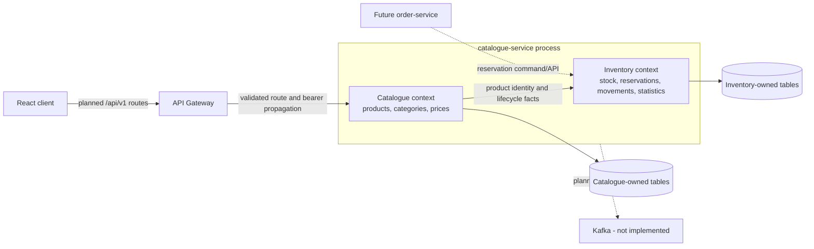

# Product Catalogue and Inventory Domain Design

## Status and evidence boundary

This document defines the proposed domain model for Product Catalogue and Inventory Management. The `catalogue-service` currently exposes only foundation health and information endpoints. The entities, persistence mappings, business APIs, gateway routes, authorization rules, inventory transactions, Kubernetes workload, and domain-event publication described here are **Planned** and must not be presented as implemented evidence.

The design is governed by [ADR-001](../adr/ADR-001-modular-microservices-architecture.md), [ADR-004](../adr/ADR-004-fastapi-versioned-rest-apis.md), [ADR-005](../adr/ADR-005-keycloak-identity-rbac.md), [ADR-006](../adr/ADR-006-postgresql-redis-data-platform.md), [ADR-007](../adr/ADR-007-kafka-domain-events.md), and [ADR-010](../adr/ADR-010-utc-timestamps-json-logs.md).

## Bounded contexts and ownership

The PoC keeps two logical bounded contexts in one deployable `catalogue-service`. They must remain separate modules with explicit application interfaces and must not share mutable domain objects.



| Context | Owns | Does not own |
| --- | --- | --- |
| Catalogue | Product metadata and lifecycle; category hierarchy and assignments; currency-specific price history | Physical/reserved stock, orders, credentials, customer data |
| Inventory | Stock balances, derived availability, stock adjustments, reservation state, immutable movement history, inventory statistics | Product descriptions/categories/prices, order lifecycle, identity roles |

Catalogue may expose a composed read model containing product, current price, and availability. Composition does not transfer source-of-truth ownership. Neither context may read another service's database directly.

## Proposed domain model

All domain identifiers are UUIDs. All stored instants are timezone-aware UTC values. Human-readable codes are alternate keys, not primary keys.

### Product

The Product aggregate owns:

- `id`: immutable UUID;
- `sku`: normalized, immutable business identifier with a database uniqueness constraint;
- `name` and validated descriptive metadata;
- `status`: `draft`, `active`, `inactive`, or `discontinued`;
- zero or more category assignments, with at most one designated primary category; and
- `created_at` and `updated_at` UTC timestamps.

SKU comparison is case-insensitive after one documented normalization rule, such as trimming and upper-casing. A SKU cannot be silently reused after discontinuation. Changing an entered SKU requires an explicit governed correction workflow because external systems may retain it.

Only `active` products appear in ordinary customer search and detail results. `draft` is editable but unpublished; `inactive` is temporarily unavailable for sale; `discontinued` is terminal for ordinary operations. Lifecycle changes do not delete price, inventory, or movement history.

### ProductCategory

The ProductCategory aggregate owns an immutable UUID, unique normalized slug, display name, optional description, status, optional `parent_id`, and UTC timestamps. An adjacency-list relationship supports a hierarchy while keeping the model understandable for the PoC.

Category invariants are:

- a category cannot parent itself or one of its descendants;
- sibling/display ordering is presentation metadata, not identity;
- deletion is rejected while products or child categories reference the category; use deactivation or an explicit reassignment transaction; and
- product-to-category assignment is many-to-many, represented by a persistence association rather than ownership of the Product itself.

### ProductPrice

ProductPrice is an effective-dated value record with its own UUID, `product_id`, ISO 4217 three-letter `currency_code`, exact decimal `amount`, `effective_from`, optional `effective_to`, actor/correlation metadata, and UTC creation timestamp.

Money must use `Decimal` in Python and a fixed-precision PostgreSQL `NUMERIC` column; binary floating point is prohibited. The proposed baseline is `NUMERIC(19,4)`, with currency-specific display rounding kept separate from stored precision. Amounts must be non-negative. Effective intervals for the same product and currency must not overlap, and at most one current price may exist at an instant. Price changes append a new effective record rather than overwriting financial history.

### InventoryItem

InventoryItem is the consistency aggregate for one product at one inventory location. The PoC may use a single governed `location_code`, but the data model retains that dimension so production warehouses do not require redefining identity. Its fields are:

- `id`, `product_id`, and `location_code`, unique as a pair;
- non-negative integer `quantity_on_hand`;
- non-negative integer `quantity_reserved`;
- a concurrency `version`; and
- UTC creation/update timestamps.

`quantity_available` is a calculated value:

```text
quantity_available = quantity_on_hand - quantity_reserved
```

It is never accepted as an independently editable input. The database and domain layer enforce `quantity_reserved <= quantity_on_hand`, so available quantity cannot be negative. Fractional units are outside the PoC assumption; supporting weighted products later requires a governed unit-of-measure model and decimal quantity policy.

### InventoryMovement

InventoryMovement is an append-only fact created for every accepted stock or reservation change. It contains an immutable UUID, `inventory_item_id`, movement type, signed `on_hand_delta`, signed `reserved_delta`, resulting balances, reason code, safe reference, actor subject/service identity, correlation ID, idempotency key, and UTC `occurred_at`.

Representative movement types are `receipt`, `adjustment`, `reservation`, `release`, and `fulfilment`. Free-text reasons are constrained and must not contain credentials, tokens, or unnecessary personal data. Update and delete operations on movement rows are prohibited at the repository and database layers. Corrections create compensating movements.

## Aggregate invariants and transaction rules

1. Product UUID and normalized SKU are unique; SKU is the external business key but not the database primary key.
2. Category graphs are acyclic, and inactive categories cannot receive new product assignments.
3. Price amount and currency are valid, and effective periods do not overlap for a product/currency pair.
4. Inventory balances are integers satisfying `on_hand >= 0`, `reserved >= 0`, and `reserved <= on_hand`.
5. Every accepted balance change and its InventoryMovement are committed in the same PostgreSQL transaction.
6. Commands carry an idempotency key unique within the inventory boundary so retries do not double-apply stock.
7. Movement history is immutable; catalogue and inventory records use UTC timestamps and UUID identifiers.
8. Products cannot be made customer-visible without an active lifecycle state. Availability does not imply sellability when the product is inactive or lacks a current price.

## Concurrency and consistency

Inventory is a contention point. A read-then-write sequence without locking can oversell stock. The planned repository operation must execute one database transaction that:

1. validates or claims the idempotency key;
2. locks the InventoryItem row with `SELECT ... FOR UPDATE` or performs a version-checked atomic update;
3. checks the proposed balances against database constraints;
4. updates the balances and version; and
5. inserts the corresponding immutable movement before commit.

Constraint or version conflicts become a stable `409 Conflict`; validation failures become `422` or a governed `400` response. Deadlocks and serialization failures receive bounded retries with structured, token-free logs. Multi-item reservations require deterministic lock ordering. Statistics and search projections may be eventually consistent, but commands and availability decisions must use the authoritative transactional state.

The initial implementation should prefer PostgreSQL reads over Redis until a measured cache requirement exists. If caching is introduced, product search and availability projections must have explicit TTL/invalidation rules; Redis must never become the stock source of truth.

## Planned API and authorization model

Routes will follow `/api/v1`, remain explicitly registered in the API Gateway, and preserve the current fixed-upstream, correlation-ID, timeout, safe-logging, and bearer-propagation conventions. Exact schemas remain an implementation concern, but the resource families are expected to include `/products`, `/categories`, `/prices`, `/inventory`, `/inventory/movements`, and `/inventory/statistics`.

| Role | Catalogue access | Inventory access |
| --- | --- | --- |
| `customer` | Search/read active products, active categories, and current prices | Read safe availability only |
| `support` | Read catalogue, including operational status where justified | Read balances, movements, and statistics required for support; no adjustments |
| `operations_admin` | Create/update products, lifecycle, categories, and prices | Receive/adjust stock and inspect balances, movements, and statistics |

Ordinary customers must never receive catalogue or inventory mutation permissions. Support access is read-only. `catalogue-service` must validate Keycloak JWT signature, issuer, audience, expiry, and roles independently of the gateway; frontend role checks remain UX only. Administrative changes require actor identity, correlation ID, safe reason, and audit/movement evidence.

## Search, availability, and statistics

Customer search includes active products only and uses bounded pagination, deterministic ordering, validated filters, and safe query limits. Operational search may include lifecycle status when the caller has `support` or `operations_admin`. A future production search index is a projection; PostgreSQL remains authoritative.

Availability is reported from the InventoryItem aggregate and may be represented as an exact quantity for authorized operational roles and a governed availability state for customers. Suggested states are `in_stock`, `low_stock`, `out_of_stock`, and `unavailable`, with thresholds configured per product or location rather than embedded in UI code.

Inventory statistics are read models derived from authoritative inventory items and movements, for example total SKUs by availability state, low/out-of-stock counts, and movement totals over a bounded UTC interval. Statistics are not balance-setting inputs and must state their refresh time and scope.

## Future Order Processing integration

Order Processing is not implemented by this design. A future order workflow should request Inventory to reserve quantities using an order-owned reference and idempotency key. Inventory atomically increments `quantity_reserved` only when sufficient availability exists and returns an explicit reservation result. Cancellation/expiry releases the reservation; fulfilment atomically decrements both on-hand and reserved quantities. Order-service must not write inventory tables directly.

Cross-service orchestration must define reservation expiry, retry, compensation, partial availability, and duplicate-message behavior. A production workflow may use a saga and transactional outbox. The synchronous reservation result is authoritative for checkout; later events distribute facts to other consumers.

## Proposed domain events

The following event names document likely facts, not an implemented Kafka integration:

- `product.created`
- `product.updated`
- `price.changed`
- `inventory.adjusted`
- `inventory.low`
- `inventory.out_of_stock`

Events require versioned schemas, aggregate/event IDs, UTC occurrence time, correlation and causation IDs, producer identity, and minimal non-sensitive payloads. A transactional outbox should couple event intent to the aggregate commit; publishers and consumers must be idempotent. Low/out-of-stock notifications need transition-based deduplication to avoid event storms. Kafka, topics, schemas, producers, consumers, and outbox processing remain Planned.

## PoC implementation boundary

The proposed PoC keeps both contexts in `catalogue-service` and would use a catalogue-owned logical PostgreSQL database with a least-privilege identity. The existing PostgreSQL deployment currently initializes only `customer_db` and `keycloak_db`; no catalogue database or credentials exist. Redis and Kafka are not deployed. No catalogue gateway mapping, Kubernetes workload, domain schema, migration, or business test exists.

The single-node kind cluster and single PostgreSQL pod share one physical GCP VM. Persistent storage improves pod-restart survival but provides no host-level high availability. Multiple service replicas on this node would not change that limitation.

## Production evolution

Production may separate Catalogue and Inventory into independently deployable services when scaling, ownership, or change cadence justifies the operational cost. Each service then owns its database and API/event contracts. Inventory should use a managed regional PostgreSQL service, tested backups and PITR, connection pooling, replicas for non-authoritative queries, explicit partitioning/archival for movement history, and monitored contention. Catalogue search may use a dedicated indexed projection, and pricing may evolve into a separate capability for market, tax, promotion, and validity complexity.

Use multi-zone Kubernetes, workload identity, external secret management, private connectivity, policy enforcement, rate limits, resilient Kafka with schema governance, an outbox relay, cache invalidation telemetry, SLOs, and reconciliation jobs. Separation must follow evidence of need; it must not create distributed transactions or shared-database coupling.

## Architecture defence notes

- Catalogue and Inventory are separated by ownership and invariants even though the PoC may package them together.
- Availability is derived because independently editable totals can contradict one another.
- PostgreSQL constraints and transactional movement recording protect stock correctness; Redis is only a possible projection cache.
- UUIDs provide stable internal identity while SKU remains a governed unique business key.
- Effective-dated decimal prices preserve precision and history.
- RBAC controls capability access, while domain invariants remain enforced for every actor.
- Kafka events are an evolution path and are not claimed as current implementation.
