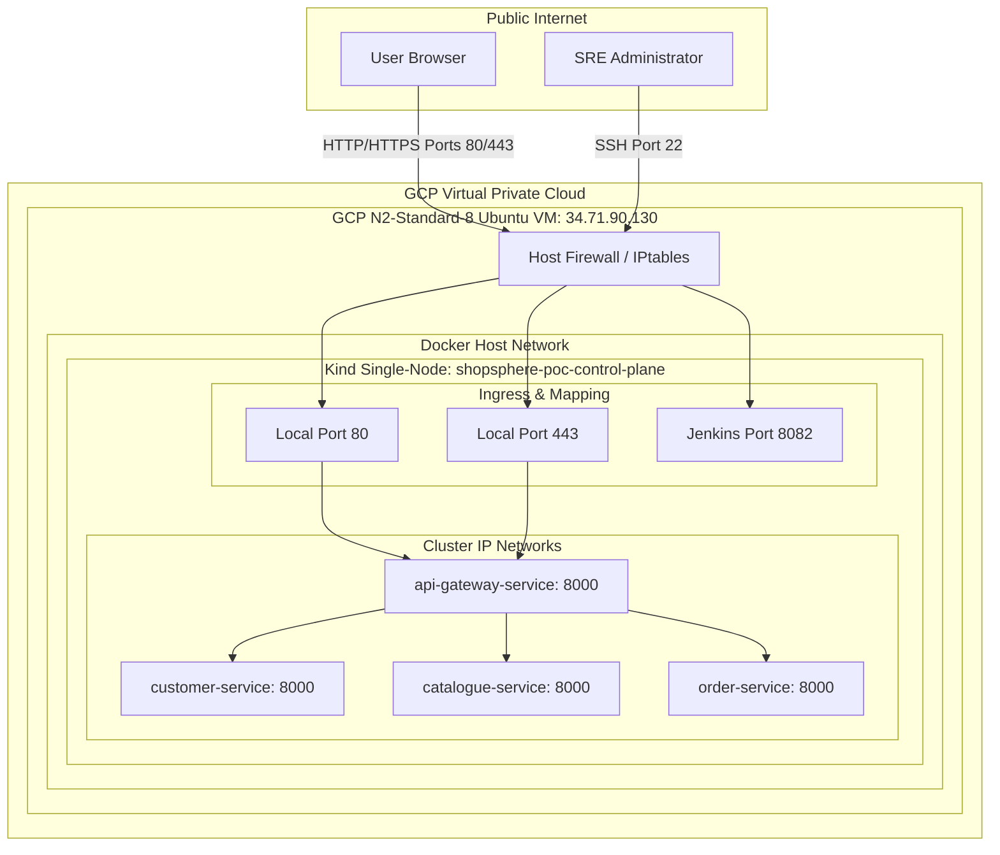
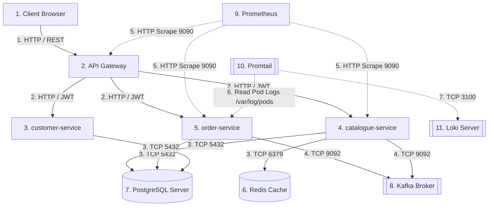
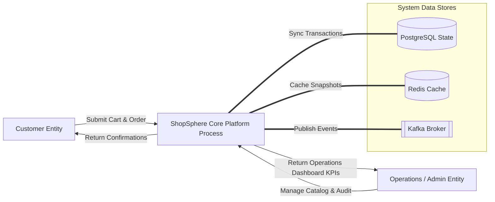
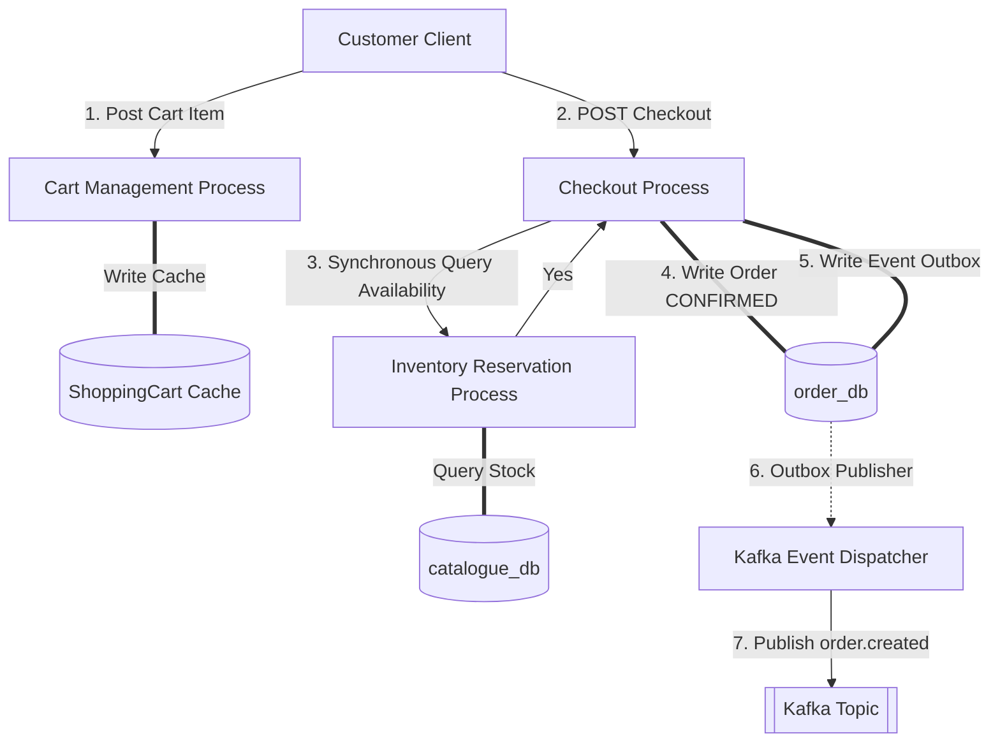

# ShopSphere Network & Data Flows (Diagrams 6–11)

This document contains the network and logical data flow maps of the ShopSphere Global Enterprise Platform, showing how data moves across systems.

---

## Diagram 6: Enterprise Network Architecture Diagram (PoC)

### Purpose
Exposes the physical network layers, port access controls, and firewall limits of the single-GCP-VM PoC node.

### Mermaid Diagram


### Accompanying Metadata
*   **Main Components:** GCP VPC, Host Firewall, static external IP, single-node Kind Kubernetes cluster, internal ClusterIP services.
*   **Key Flow:** Browsers target host port 80/443, mapped internally via Docker-proxy to the Kind API Gateway pod. Administrators use secure SSH tunnels (Port 22) to query database, metrics, and Jenkins (`8082`) ports.
*   **Architecture Decisions:** No public NodePort or LoadBalancer services are defined for data tiers (Postgres, Redis, Kafka) or telemetry to maintain complete network isolation.
*   **PoC Limitations:** Single external GCP host VM constitutes a physical single-point-of-failure (SPOF).
*   **Viva Talking Points:** "How is administrative traffic secured? Database and SIEM services are bound strictly to internal loopback `127.0.0.1` inside Kubernetes and accessed externally only via authenticated SSH tunnels."

---

## Diagram 7: Network Flow Diagram

### Purpose
Illustrates the network traversal sequence, detailing numerical paths for scraping, logs, events, and standard business calls.

### Mermaid Diagram


### Accompanying Metadata
*   **Main Components:** Web clients, gateway, microservices, databases, Kafka broker, Promtail, Loki, and Prometheus.
*   **Key Flow:** Traverses sequentially: Inbound APIs (1) $\rightarrow$ Service Delegation (2) $\rightarrow$ Persisted DB Queries (3) $\rightarrow$ Async Outbox Eventing (4) $\rightarrow$ Prometheus scraping (5) $\rightarrow$ Promtail log harvests (6-7).
*   **Architecture Decisions:** Used W3C distributed tracecontext standards to propagate trace headers through headers 1 and 2 automatically.
*   **PoC Limitations:** High log-aggregation volumes on Promtail compete for disk IOPS on the shared physical VM disk.
*   **Viva Talking Points:** "Where does scraping happen? Prometheus queries the `/metrics` endpoints asynchronously every 15 seconds over internal ClusterIP networks without passing through the public API Gateway."

---

## Diagram 8: Data Flow Diagram Level 0

### Purpose
Represents the highest level context diagram, showing external boundaries and core logical processes.

### Mermaid Diagram


### Accompanying Metadata
*   **Main Components:** Customer, SRE Admin, ShopSphere Core Process, datastores.
*   **Key Flow:** Encapsulates the complete system context. External actors interact exclusively through the core edge interfaces, which manage State (Postgres), Caching (Redis), and asynchronous publish/subscribe pipelines (Kafka).
*   **Architecture Decisions:** Encapsulated all capability boundaries within a single logical system process at Level 0 to maintain clean external boundary separation.
*   **PoC Limitations:** Does not detail microservice interface divisions.
*   **Viva Talking Points:** "Level 0 context proves that external entities have absolutely no direct access to system databases; all interactions must pass through the validated platform process."

---

## Diagram 9: Data Flow Diagram Level 1

### Purpose
Exposes data traversal, process logic, and data store writes during the customer-order checkout journey.

### Mermaid Diagram


### Accompanying Metadata
*   **Main Components:** Shopping Cart Process, Checkout Process, Inventory Reservation Process, outbox publisher, and Kafka broker.
*   **Key Flow:** Tracks data sequentially: Cart updates (1) $\rightarrow$ Checkout validation (2) $\rightarrow$ Double-entry stock check (3) $\rightarrow$ Order & outbox SQL insert (4-5) $\rightarrow$ Outbox dispatch to Kafka (6-7).
*   **Architecture Decisions:** Settled on a reservation-based checkout Saga (ADR-011) to guarantee that stock is reserved synchronously inside a PostgreSQL transaction *prior* to committing the order.
*   **PoC Limitations:** Failed outbox dispatches rely on single-process container loops.
*   **Viva Talking Points:** "How is stock safety guaranteed under concurrent load? The Inventory Reservation Process queries `inventory_items` using `SELECT FOR UPDATE` on the database row to prevent double-allocation/race-conditions."

---

## Diagram 10: Software Component Diagram

### Purpose
Deconstructs the internal package layout, dependencies, and code layers within a standard ShopSphere FastAPI microservice.

### Mermaid Diagram
```mermaid
graph TD
    subgraph FastAPI_Service [FastAPI Service Package Layout]
        subgraph API_Layer [Transport Layer: app/api]
            V1[v1 Router]
            SCH[Schemas: Pydantic]
        end

        subgraph Application_Layer [Orchestration Layer: app/application]
            UC[Use Cases / UseCase Services]
        end

        subgraph Domain_Layer [Domain Layer: app/domain]
            ENT[Entities: Domain Models]
            REP_INT[Repository Interfaces]
        end

        subgraph Infrastructure_Layer [Infrastructure Layer: app/infrastructure]
            DB_REP[Database Repositories]
            ORM[ORM Models: SQLAlchemy]
            HTTP_CLI[HTTP/REST Clients]
        end
    end

    %% Dependencies
    V1 -->|Validate requests| SCH
    V1 -->|Invoke use cases| UC
    UC -->|Query domain rules| ENT
    UC -->|Interact with storage| REP_INT
    DB_REP -.-|>|Implement| REP_INT
    DB_REP -->|Fetch data| ORM
```

### Accompanying Metadata
*   **Main Components:** Transport (api), Orchestration (application), Domain (domain), and Persistence (infrastructure) layers.
*   **Key Flow:** Inbound HTTP calls enter `app/api`, validate JSON against `Schemas`, invoke `app/application` orchestrators, evaluate domain invariants in `app/domain`, and fetch states from `app/infrastructure`.
*   **Architecture Decisions:** Applied strict **Clean Architecture (Layered Design)** to keep the Core Domain Layer (`app/domain`) completely free of database-specific dependencies (such as SQLAlchemy or PostgreSQL types).
*   **PoC Limitations:** Use Cases occasionally manage transactional scope directly due to SQL session sharing.
*   **Viva Talking Points:** "How is database decoupling enforced? The application layer depends only on Repository Interfaces defined in the Domain. The concrete implementation (SQLAlchemy repositories) is injected dynamically at startup."

---

## Diagram 11: UML Class Diagram

### Purpose
Represents the domain entities, properties, and relationships within the ShopSphere backend domain.

### Mermaid Diagram
```classDiagram
    class CustomerProfile {
        +UUID id
        +string identity_provider_subject
        +string email
        +string status
        +datetime created_at
    }

    class CustomerAddress {
        +UUID id
        +UUID customer_id
        +string street
        +string city
        +boolean is_default
    }

    class Product {
        +UUID product_id
        +string sku
        +string name
        +boolean is_searchable
    }

    class ProductPrice {
        +UUID price_id
        +UUID product_id
        +Decimal amount
        +string currency
    }

    class InventoryItem {
        +UUID inventory_id
        +UUID product_id
        +int on_hand
        +int reserved
        +int version
    }

    class ShoppingCart {
        +UUID cart_id
        +string customer_subject
        +string currency
    }

    class CartItem {
        +UUID item_id
        +UUID cart_id
        +UUID product_id
        +int quantity
    }

    class Order {
        +UUID order_id
        +string order_number
        +string customer_subject
        +string status
        +Decimal total
    }

    class OrderItem {
        +UUID item_id
        +UUID order_id
        +UUID product_id
        +Decimal unit_price
        +int quantity
    }

    CustomerProfile "1" --> "0..*" CustomerAddress : owns
    Product "1" --> "0..*" ProductPrice : pricing
    Product "1" --> "1" InventoryItem : stock
    ShoppingCart "1" --> "0..*" CartItem : contains
    Order "1" --> "0..*" OrderItem : contains
```

### Accompanying Metadata
*   **Main Components:** Profiles, Addresses, Products, Prices, Inventory, Carts, Orders, and Order Items.
*   **Key Flow:** Class properties enforce Decimal precision for pricing/revenue (`ProductPrice` and `Order`) and optimistic version locks (`InventoryItem.version`) to prevent concurrent write collisions.
*   **Architecture Decisions:** Modeled all financial values using `Decimal` and database `NUMERIC` types to avoid binary floating-point errors (ADR-010).
*   **PoC Limitations:** Customer Profiles are linked to Orders via the Keycloak string subject (`customer_subject`) rather than a direct database foreign key to maintain strict service isolation.
*   **Viva Talking Points:** "Why isn't there a foreign key between Order and CustomerProfile? Direct database-level foreign keys across microservices violate service autonomy. We decouple them by referencing Keycloak's unique subject string."
