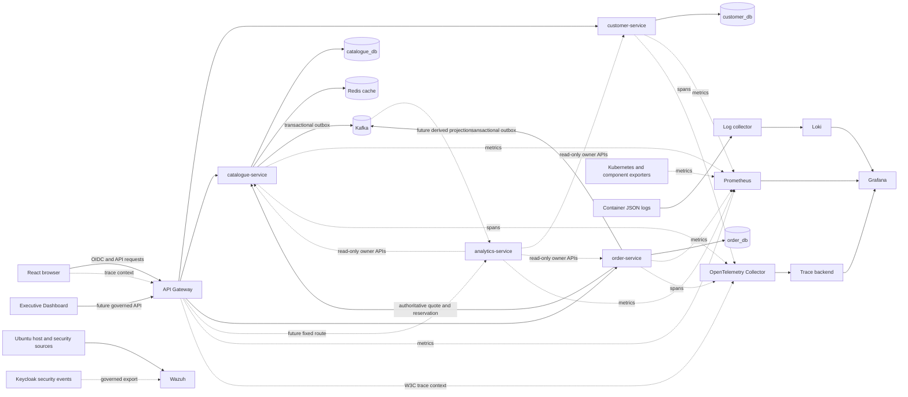

# Executive Operations and Observability Architecture

## Status and evidence boundary

This document defines the architecture for ShopSphere business analytics, application
observability, infrastructure monitoring, and security monitoring. Application metrics
instrumentation exists; monitoring workloads remain a separate platform concern.

Current repository evidence is limited to:

- structured JSON application logs with UTC timestamps and correlation IDs;
- bounded `X-Request-ID` validation and propagation through Gateway/service calls;
- `/health/live` and `/health/ready` endpoints;
- internal Prometheus-compatible `/metrics` endpoints on API Gateway, customer-service,
  catalogue-service, order-service, and analytics-service;
- bounded HTTP, process/runtime, Gateway dependency, checkout, reservation, cache,
  outbox-publication, and analytics-aggregation metrics;
- Kubernetes probes and resource requests/limits for deployed workloads;
- domain audit records, status history, inventory movements, and transactional outboxes;
- a React executive dashboard driven by explicitly labelled mock data;
- analytics-service read-only executive aggregation APIs with explicit partial-source
  status and Prometheus instrumentation;
- Jenkins execution of Black, Ruff, Bandit, Pytest, frontend checks, builds, and
  infrastructure validation.

Prometheus, Grafana, OpenTelemetry, Loki, Wazuh, Semgrep, Trivy, and OPA remain prescribed
platform controls but have no deployed or retained runtime execution evidence in the
repository. Exposing metrics does not mean Prometheus has been deployed.

## Architectural principles

1. Domain services remain authoritative for business state and calculations.
2. Analytics-service composes read-only projections; it does not write transactional
   customer, catalogue, inventory, or order state.
3. Metrics, logs, traces, health, domain audit, and security events are different record
   classes with different access, retention, and integrity needs.
4. Telemetry failure must not corrupt a business transaction. Local buffering and
   recoverable outboxes are preferred where loss would affect evidence.
5. Labels and indexes are bounded. Customer IDs, order IDs, product IDs, JWT subjects,
   email addresses, correlation IDs, and raw paths are never Prometheus labels.
6. Telemetry contains no credentials, bearer tokens, refresh tokens, passwords,
   database URLs, Keycloak secrets, or unnecessary personal data.
7. The PoC topology is observable but not highly available. It cannot independently
   observe the complete loss of its only host.

## Observability boundaries

| Boundary | Questions answered | Authoritative sources | Primary target tools | Not a substitute for |
| --- | --- | --- | --- | --- |
| Business observability | What business activity occurred and what is its current aggregate state? | Customer, Catalogue/Inventory, and Order domain stores and governed APIs | analytics-service, React executive dashboard, selected Grafana panels | Transactional databases or financial accounting |
| Application observability | Are APIs fast, receiving traffic, failing, or saturated? Where did a request spend time? | Instrumented services and API Gateway | Prometheus, OpenTelemetry, Grafana, Loki | Domain audit history |
| Infrastructure observability | Are Kubernetes, nodes, pods, storage, databases, cache, and broker healthy? | Kubernetes and component exporters | Prometheus and Grafana | Application correctness or security monitoring |
| Security observability | Is there suspicious host, file, authentication, or policy activity? | Ubuntu host, Keycloak security events, runtime security sources, CI scan outputs | Wazuh and a future centralized SIEM | Prometheus/Grafana service monitoring |

Domain audit records remain in their owning service. `CustomerAuditEvent`,
`InventoryMovement`, `OrderAuditEvent`, and `OrderStatusHistory` are durable business or
security evidence; they are not reconstructed from Loki logs. Keycloak remains the
source for authentication events.

## Logical telemetry architecture

Dashed flows are target integrations. No telemetry backend, trace store, analytics
consumer, or security manager is currently deployed by repository manifests.

## Business KPI ownership

### KPI definitions

| Dashboard KPI | Owning source | Definition | Analytics treatment |
| --- | --- | --- | --- |
| Orders processed | order-service | Distinct orders that reached `CONFIRMED` during the selected UTC interval; status-history data avoids counting retries twice | Query an Order-owned summary API; group by interval and status |
| Simulated revenue | order-service | Sum of immutable `Order.total` for `CONFIRMED`, `PROCESSING`, or `FULFILLED` orders; exclude `CANCELLED`/`FAILED` | Return per currency; never combine currencies without an explicit governed FX policy; label as simulated order value because no payment settlement exists |
| Customer registrations | customer-service | Customer business profiles provisioned during the selected interval, based on immutable Keycloak subject linkage/profile-created audit | Query a Customer-owned summary API; Keycloak registration events remain identity/security evidence rather than the business count |
| Product availability | catalogue-service | Active/searchable product counts grouped by derived availability state | Use Catalogue-owned availability/statistics API; PostgreSQL remains authoritative and Redis remains disposable |
| Inventory status | catalogue-service | Tracked, in-stock, low-stock, out-of-stock, on-hand, reserved, and available aggregates | Use existing persisted inventory statistics calculations; never sum cached values as authority |
| Order fulfilment status | order-service | Current counts and transition counts for `CONFIRMED`, `PROCESSING`, `FULFILLED`, and `CANCELLED` | Query Order-owned status summaries; do not infer fulfilment from Kafka delivery |
| System performance | each instrumented service/platform component | Golden Signals and resource state | Query Prometheus through a protected server-side integration or render in Grafana; not a domain KPI |
| Application health | each service and Kubernetes | Liveness, readiness, scrape health, dependency state, and pod status | Present a safe aggregate without exposing internal addresses or credentials |
| Operational alerts | Prometheus rule evaluation and governed business conditions | Active actionable conditions with severity, start time, safe summary, and runbook | Present a bounded projection; alert routing remains operational infrastructure |

The dashboard must show a data timestamp, selected UTC interval, currency, and whether a
panel is live, delayed, unavailable, or demonstration data. A missing source must produce
an explicit partial/error state, not a fabricated zero.

### Read-only analytics composition

The intended PoC implementation is a thin analytics-service composition boundary:

1. The frontend calls a fixed, authenticated Gateway route such as
   `/api/v1/analytics/executive-summary`.
2. Gateway forwards only to the configured analytics-service origin.
3. Analytics-service uses a dedicated least-privilege service identity to call bounded
   summary endpoints owned by customer-service, catalogue-service, and order-service.
4. Each owner calculates from its own authoritative schema and returns a typed aggregate.
5. Analytics-service normalizes timestamps, currencies, freshness, partial failures, and
   response shape without modifying source data.

Analytics-service must not connect directly to `customer_db`, `catalogue_db`, or
`order_db`. Short-lived response caching may be introduced only with explicit freshness
metadata and invalidation/TTL rules. It cannot become authority for prices, inventory,
customer identity, orders, or revenue.

For higher volume or longer historical windows, analytics-service may consume versioned
Kafka facts into a rebuildable read model. The current broker has producers but no
consumers. A future consumer must be idempotent by `event_id`, tolerate at-least-once
delivery, expose consumer lag, reconcile projections against owner APIs, and document
eventual consistency. Raw transactional tables are not copied indiscriminately.

## Application observability

### Golden Signals

| Signal | Measurement | Interpretation |
| --- | --- | --- |
| Latency | Request-duration histograms and upstream-client spans | User-visible and dependency latency, separated by bounded route template and status class |
| Traffic | Request counters/rates and controlled business-operation counters | Demand by service, method, and route template |
| Errors | HTTP 5xx/4xx rates, exception counters, failed dependency calls, outbox failures | Service faults versus governed client/domain rejection |
| Saturation | In-flight requests, worker/connection-pool utilization, CPU/memory, queue/outbox age | Exhaustion risk before availability loss |

### Common FastAPI metric contract

Every FastAPI service and API Gateway exposes an internal `/metrics` endpoint with a
shared naming and label policy:

- `shopsphere_http_requests_total{service,environment,method,route,status_class}`;
- `shopsphere_http_request_duration_seconds{service,environment,method,route}` histogram;
- `shopsphere_http_requests_in_progress{service,environment}` gauge;
- `shopsphere_service_info{service,version,environment}` fixed-value gauge.

The Prometheus Python client also exports standard `process_*`, `python_info`, and
`python_gc_*` runtime series from each process. Service-specific bounded metrics are:

- Gateway: `shopsphere_gateway_upstream_requests_total` and
  `shopsphere_gateway_upstream_request_duration_seconds`;
- Order: `shopsphere_order_checkout_attempts_total`,
  `shopsphere_order_checkout_results_total`, and `shopsphere_order_transitions_total`;
- Catalogue: `shopsphere_inventory_reservation_attempts_total`,
  `shopsphere_inventory_reservation_results_total`,
  `shopsphere_catalogue_cache_requests_total`, and
  `shopsphere_outbox_publications_total`;
- Analytics: `shopsphere_dashboard_aggregations_total` and
  `shopsphere_analytics_dependency_requests_total`.

`route` is the framework route template such as `/api/v1/orders/me/{order_id}`, never
the raw URL. Unmatched requests use the literal `unmatched`. Query strings are excluded
and status is recorded as a bounded class (`2xx`, `4xx`, `5xx`). Metric tests verify that
dynamic identifiers and sensitive markers do not appear in exposition output.

`/metrics` is deliberately unauthenticated for Prometheus compatibility but is an
internal operational endpoint. Kubernetes Services remain `ClusterIP`; NetworkPolicy
and scrape discovery must allow only the monitoring namespace or collector path. It
must not be routed through public ingress. Prometheus is not deployed by this change.

Additional bounded metrics may cover database-pool saturation, dependency latency,
cache hit/miss/error totals, Kafka publish attempts, outbox pending count and oldest age,
and checkout compensation/reconciliation counts. Product, customer, cart, reservation,
or order identifiers must not appear as labels.

### Health semantics

- Liveness answers whether the process/event loop can serve; it must not depend on every
  downstream system.
- Readiness answers whether the service can safely accept its critical traffic.
- Customer, Catalogue, and Order readiness currently depends on their authoritative
  PostgreSQL database.
- API Gateway readiness currently requires customer, catalogue, and order upstreams.
- Redis is optional for Catalogue correctness because PostgreSQL is authoritative.
- Kafka is asynchronous behind recoverable outboxes and must not disable synchronous
  reads or committed writes merely because publication is delayed.
- analytics-service currently has no dependencies and therefore reports skeleton
  readiness only; its future readiness/degraded response must reflect configured owner
  sources without hiding partial data.

Health endpoints are not metrics substitutes. Prometheus records trends and alert
duration; Kubernetes probes control workload lifecycle.

## Structured logging and Loki

### Log schema

Target application logs use one JSON object per line with:

- `timestamp` — timezone-aware UTC ISO 8601;
- `level` — normalized severity;
- `service`, `version`, and `environment`;
- `logger` and stable `event` name;
- `correlation_id`;
- `trace_id` and `span_id` when tracing exists;
- `message`;
- bounded safe context such as HTTP method, route template, status, duration, dependency
  name, retry attempt, or outbox status.

The current formatters provide timestamp, level, logger, message, correlation ID, and
caller-supplied event context. Consistently injecting service, version, environment,
trace ID, and span ID remains planned.

Logs never contain JWTs, refresh tokens, passwords, cookies, authorization headers,
database credentials, Keycloak client secrets, raw request bodies, or sensitive
authentication details. Customer/order/product identifiers may be placed in a carefully
reviewed log field only when operationally necessary, but they are not Loki labels and
must follow retention/access rules. Prefer correlation and trace IDs.

### Loki flow

A node-level collector should read Kubernetes container stdout/stderr, parse the JSON
schema, attach bounded Kubernetes metadata, and forward to Loki. Recommended Loki index
labels are limited to cluster, namespace, service, environment, container, and level.
Correlation ID, trace ID, message, exception, raw path, and domain identifiers remain
structured fields queried at inspection time.

Grafana queries Loki for request/error investigation and links a selected log to its
trace when `trace_id` exists. Loki is not the source for business totals, immutable audit
history, or inventory movements. PoC retention should be short and capacity-bounded;
production logs require durable object storage, access control, encryption, retention
tiers, and deletion/legal-hold governance.

## OpenTelemetry tracing

ShopSphere adopts W3C Trace Context (`traceparent` and, where governed, `tracestate`) for
distributed propagation. `X-Request-ID` remains a user-visible diagnostic correlation
identifier; it is not used as a trace ID.

Application tracing is implemented in API Gateway, Customer, Catalogue, Order, and
Analytics services using the OpenTelemetry SDK and FastAPI instrumentation. It is
disabled by default, and no Collector or trace-storage backend is deployed. Enabling
export without an explicit Collector endpoint is rejected during application startup;
this prevents an implicit local endpoint from becoming an undocumented dependency.

1. The browser may create or propagate a sampled trace for API requests without adding
   identity or business data to baggage.
2. API Gateway accepts valid trace context or creates a new root span, then forwards it
   through fixed upstream clients.
3. Customer, Catalogue, Order, and Analytics services create server spans. Bounded
   `httpx2` adapters create client spans and inject W3C context for Gateway-to-service,
   Order-to-Catalogue, Analytics-to-domain-service, and Customer-to-Keycloak calls.
4. Order-to-Catalogue quote/reserve/release calls propagate trace and correlation headers.
5. High-value internal spans identify checkout orchestration, inventory reservation, and
   dashboard summary aggregation. They deliberately omit entity identifiers.
6. A future OpenTelemetry Collector will receive OTLP/HTTP traffic on an internal endpoint
   and provide batching, policy enforcement, and forwarding to a chosen trace backend.

Span attributes use bounded HTTP route templates, service names, HTTP methods/statuses,
and dependency names. Request/response header capture is not enabled. JWT subjects,
emails, customer/order/product IDs, token content, SQL parameters, request bodies, and
high-cardinality baggage are prohibited. Manual spans mark failures without recording
exception messages or request data. Only W3C Trace Context is propagated; arbitrary
incoming baggage is not forwarded.

Structured JSON logs include nullable fixed-width `trace_id` and `span_id` fields
alongside `correlation_id`. A log emitted inside a valid span can therefore be joined to
its trace without using those identifiers as Loki index labels.

### Runtime configuration

| Variable | Purpose | Safe behavior |
| --- | --- | --- |
| `TELEMETRY_ENABLED` | ShopSphere instrumentation/export switch | Defaults to `false` |
| `OTEL_SDK_DISABLED` | Standard OpenTelemetry SDK shutdown switch | `true` overrides the ShopSphere enable switch |
| `OTEL_EXPORTER_OTLP_TRACES_ENDPOINT` | Explicit OTLP/HTTP traces receiver URL | Preferred signal-specific setting |
| `OTEL_EXPORTER_OTLP_ENDPOINT` | Generic OTLP/HTTP Collector base URL | Accepted alternative |
| Other `OTEL_EXPORTER_OTLP_*` settings | Timeout, TLS, headers, and compression | Standard SDK environment handling; credential-bearing headers belong in Secrets |

One of the two endpoint variables is required when telemetry is enabled. The application
sets resource attributes from its non-secret service name, version, and environment and
does not hard-code a vendor or trace backend. Sampling policy must be defined and
validated with the future Collector/runtime configuration before production.

Kafka event `correlation_id` supports cross-boundary investigation; a future governed
trace-context field may link producer and consumer spans. It must not change event
idempotency or ordering semantics.

## Prometheus scraping and infrastructure telemetry

Prometheus should use Kubernetes service discovery with explicit allow-list annotations
or ServiceMonitor resources if a Prometheus Operator is intentionally installed. Metrics
ports remain ClusterIP/internal and are not exposed through public ingress. Relabeling
must drop unapproved labels before ingestion.

| Target | Intended telemetry | Current state |
| --- | --- | --- |
| Five FastAPI workloads, including API Gateway | Common HTTP/runtime/service metrics and selected bounded dependency/business metrics | `/metrics` is implemented and unit validated; scraping is not configured |
| Kubernetes API/kubelet | Node, pod, container CPU/memory, restart, and filesystem metrics | Kubernetes reports current state; Prometheus scraping not configured |
| kube-state-metrics | Desired versus available replicas, pod status, PVC state | Not deployed |
| node exporter | Ubuntu host CPU, memory, filesystem, network, load | Not deployed |
| PostgreSQL exporter | Connectivity, connections, locks, transaction rate, storage; no SQL text/credentials | Not deployed |
| Redis exporter | Availability, memory, evictions, operations, cache behavior | Not deployed |
| Kafka exporter/JMX | Broker health, topic/partition state, produce errors, storage, consumer lag when consumers exist | Not deployed |
| OpenTelemetry application instrumentation | FastAPI server spans, bounded HTTP client spans, W3C propagation, log correlation | Implemented and unit validated across five services |
| OpenTelemetry Collector | Accepted/dropped spans, queue/export failures | Not deployed |

Scrape intervals and retention must fit the shared 32 GB VM. Metrics storage needs a
bounded PVC and deletion/retention policy. Exporter credentials, if required, use
least-privilege Kubernetes Secrets and must not appear in labels, configuration examples,
or Grafana variables.

## Grafana dashboard design

### ShopSphere Service Overview

- service `up`, readiness, error rate, request rate, and p95 latency;
- pod availability/restarts and resource saturation;
- PostgreSQL, Redis, Kafka, outbox, and collector summary;
- active alerts and links to runbooks/logs/traces.

### API Performance

- Gateway and service request rate by bounded route template;
- p50/p95/p99 duration;
- 4xx versus 5xx and dependency timeout/unavailable rates;
- in-flight requests and worker/database-pool saturation;
- trace exemplars when supported.

### Order Processing

- orders processed and simulated order value per currency;
- status distribution and transitions;
- checkout success/conflict/error rate and latency;
- inventory reservation/release/compensation outcomes;
- order and catalogue outbox pending count/oldest age;
- explicit statement that simulated value is not payment revenue.

### Kubernetes and Platform Health

- node CPU, memory, filesystem, and load;
- pod desired/ready state, restarts, OOM kills, and resource utilization;
- PVC capacity/state;
- PostgreSQL, Redis, Kafka, Keycloak, and telemetry component availability;
- scrape/collector health and monitoring-stack saturation.

Grafana access should be internal and role-governed. The executive React dashboard is a
business application surface; Grafana remains an engineering/operations surface. They
may share source aggregates but do not need identical authorization or presentation.

## Alerting strategy

Alerts must be actionable, deduplicated, severity-labelled, and linked to a runbook.
Thresholds begin conservatively and are tuned using measured baselines.

| Alert | Initial condition | Severity | Response intent |
| --- | --- | --- | --- |
| Service unavailable | `up == 0` or critical readiness absent for 2 minutes | Critical | Check pod, dependency, recent rollout, and host state |
| High server error rate | 5xx ratio above 5% for 5 minutes with a minimum traffic floor | Warning/Critical | Correlate Gateway/service logs and traces; exclude governed 4xx rejections |
| Excessive latency | p95 above 1 second for 10 minutes with traffic floor | Warning | Locate route/dependency saturation before paging |
| Repeated pod restart | More than 2 restarts in 15 minutes | Warning | Inspect termination reason, OOM, probe, and node pressure |
| PostgreSQL unavailable | Exporter/database readiness failure for 1 minute | Critical | Protect writes, inspect pod/PVC, and follow recovery runbook |
| Outbox delivery delayed | Oldest pending event above 5 minutes or retry backlog rising | Warning | Check Kafka/relay; business commit remains authoritative |
| Telemetry pipeline degraded | Scrape/collector/log-export failures sustained for 5 minutes | Warning | Restore visibility; do not misreport service health as healthy from missing data |
| Low/out-of-stock condition | Aggregate low/out-of-stock count changes or governed domain event occurs | Informational/Warning | Route to operations without paging once per product transition |

Per-product low-stock alerts must not create `product_id` Prometheus labels. Catalogue
already emits transition-based low/out-of-stock domain facts; a future consumer can
create deduplicated operational work items, while Prometheus exposes only aggregate
counts. Redis failure is normally a warning because Catalogue falls back to PostgreSQL.
Kafka failure becomes urgent when outbox age/backlog breaches recovery objectives, not
for every transient publish retry.

Prometheus rule evaluation and a future Alertmanager should route by severity and
ownership. The PoC may use a local receiver or Grafana display, but must not claim paging
resilience. Production needs on-call routing, maintenance windows, inhibition,
deduplication, escalation, and post-incident review.

## Security observability and Wazuh boundary

Wazuh is responsible for host and security monitoring, not application latency or
business KPIs. Intended sources include:

- Ubuntu authentication, privilege, service, package, and kernel/security events;
- controlled file-integrity monitoring for system configuration, Jenkins configuration,
  Kubernetes/bootstrap assets, and other approved paths;
- Docker/kind host activity and selected Kubernetes audit/runtime events where feasible;
- Keycloak failed-login, brute-force, administrative, and role-change events through a
  privacy-governed export;
- security control and incident indicators routed to a centralized SIEM in production.

File-integrity scope must exclude mutable databases, container layers, build caches,
logs, and secrets to prevent alert floods or sensitive collection. Wazuh agents require
least privilege and protected enrollment keys. Keycloak event export must minimize IP,
device, user, and session information and apply access/retention governance.

Prometheus answers availability/performance; Loki supports application-log diagnosis;
OpenTelemetry explains request paths; Wazuh detects security-relevant host activity;
domain audit stores prove governed business changes. No single tool replaces the others.

## DevSecOps control model

| Control | Purpose | Execution point | Evidence state |
| --- | --- | --- | --- |
| Black | Deterministic Python formatting | Jenkins and local validation | Implemented in Jenkins |
| Ruff | Python quality and selected static rules | Jenkins and local validation | Implemented in Jenkins |
| Pytest | Unit, integration, and controlled E2E behavior | Jenkins/local; live suites require explicit environment | Implemented; evidence varies by suite |
| Bandit | Python security anti-pattern scanning | Fail-closed Jenkins stages for customer, catalogue, and order services | Implemented for those services |
| Semgrep | Cross-language SAST and organization rules | Planned Jenkins gate before builds | Pending / Not Verified |
| Trivy | Dependency/filesystem, image, and IaC misconfiguration scanning | Planned before image acceptance and promotion | Pending / Not Verified |
| OPA | Policy-as-code for Kubernetes/Terraform/build rules | Planned after rendering manifests and before deployment approval | Pending / Not Verified |
| Wazuh | Runtime host/security monitoring and file integrity | Runtime host/security platform, not a source-code lint stage | Pending / Not Verified |

Semgrep, Trivy, and OPA require pinned rules/policies, severity thresholds, exception
owners, expiry dates, fail behavior, machine-readable reports, and artifact retention
before becoming enforcement gates. OPA policies should address privileged containers,
root execution, missing limits/probes, public data services, unapproved image sources,
and dangerous Terraform exposure. Trivy must scan the exact built image digest when
promotion exists. Scan tools never receive production secrets and reports are reviewed
for sensitive paths/content before archival.

Ruff and Black improve quality but are not vulnerability scanners. Pytest proves tested
behavior, not absence of vulnerabilities. Bandit and Semgrep are complementary static
controls. Wazuh observes runtime security and is not a CI substitute.

## Access, retention, and failure behavior

- Metrics, logs, traces, dashboards, and Wazuh consoles remain internal; browser access
  in the PoC uses controlled port-forwarding rather than public administration ports.
- Grafana administrative credentials and exporter credentials use Kubernetes Secrets;
  no default passwords are committed.
- Business dashboard APIs require Keycloak authentication and backend role enforcement.
- Dashboard responses expose aggregates and safe alerts, not customer/order-level PII.
- Missing telemetry is displayed as unknown/unavailable, never as zero or healthy.
- Retention is independently defined for metrics, application logs, traces, domain audit,
  Keycloak security events, and Wazuh/SIEM records.
- Monitoring writes do not participate in business transactions. Kafka/outbox and audit
  records retain their own recovery guarantees.

## PoC limitations

- All workloads run on one physical GCP VM and one kind node.
- Monitoring components would share CPU, memory, storage, network, and failure domain
  with the services they observe.
- Prometheus/Loki local retention would be capacity-bounded and not externally redundant.
- Failure of the VM can remove applications, monitoring, logs not yet exported, and local
  alert routing simultaneously.
- Local observability cannot independently detect or report a fully failed host without
  an external heartbeat or external monitoring location.
- Multiple monitoring pods on the one node would not provide host-level high availability.
- The PoC has one PostgreSQL server, Redis instance, and Kafka broker; their exporters do
  not create resilience.
- NetworkPolicy declarations depend on a compatible CNI; current kindnet enforcement
  must not be assumed.
- No monitoring/security stack deployment, live scrape, dashboard, alert, trace, log
  query, Wazuh event, Semgrep report, Trivy report, or OPA decision is currently evidenced.

Resource budgets must preserve headroom for business workloads. Cardinality, retention,
sampling, log volume, and dashboard query load require explicit limits before deployment.

## Production evolution

Production should run stateless services on multi-zone GKE with measured horizontal
autoscaling and managed load balancing. Telemetry should leave the application failure
domain through dedicated, horizontally scaled OpenTelemetry collectors and node agents.
Use managed or independently operated multi-zone metrics, durable object-backed Loki/log
storage, a scalable trace backend, long-term retention tiers, protected Grafana, and
externally resilient alert routing.

Define service-level indicators and objectives for availability, latency, correctness,
checkout success, inventory reservation integrity, and event-delivery delay. Use SLO
burn-rate alerts instead of static thresholds alone. Autoscaling signals should be
bounded, stable, and workload-relevant; avoid scaling directly on noisy raw latency or
high-cardinality business dimensions.

Centralize security monitoring in an independently available SIEM, forward governed
Wazuh and identity events, apply workload identity and mTLS where appropriate, and use
external secret management. Production telemetry requires encryption in transit and at
rest, tenant/access isolation, audit of observability administration, backup/recovery,
capacity planning, and tested incident procedures.

Use managed/HA PostgreSQL, replicated Redis, and managed/multi-broker Kafka across zones.
Analytics may evolve to idempotent event-driven read models with schema governance,
reconciliation, lag objectives, and disaster recovery. A multi-region design is justified
only by explicit availability, latency, recovery, and data-residency requirements.

## Viva defence notes

- Explain why business KPIs stay owned by domain services while analytics-service
  composes read-only views.
- Distinguish simulated order value from settled financial revenue.
- Use the Golden Signals to explain service health and show why health probes alone are
  insufficient.
- Explain why correlation IDs are useful but unsuitable as metric/log index labels.
- Defend the separation among logs, traces, metrics, domain audit, and Wazuh security
  events.
- State plainly that colocated monitoring cannot observe total host loss independently
  and that the current telemetry stack remains planned.
