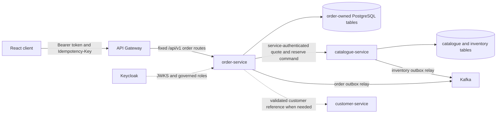
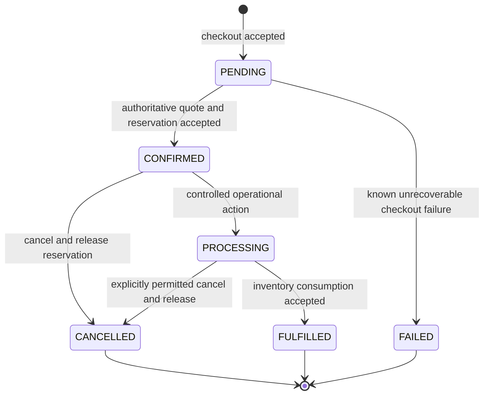
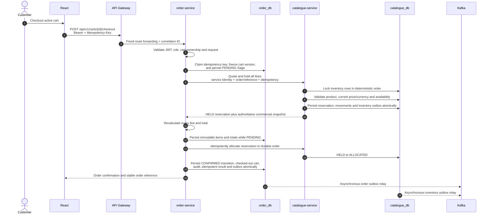

# Enterprise Order Processing Domain Design

## Status and evidence boundary

This document defines the target bounded context for Enterprise Order Processing. It is
an accepted design baseline, not implementation evidence. The repository currently
contains the independently buildable `order-service` FastAPI foundation with health and
information endpoints plus an empty, platform-validated logical `order_db` owned by
`order_app`. Order schemas/migrations, repository persistence, cart and order APIs,
inventory reservation commands, gateway routes, React order screens, order events,
deployment, and domain tests are **Planned**.

The design is governed by [ADR-001](../adr/ADR-001-modular-microservices-architecture.md),
[ADR-004](../adr/ADR-004-fastapi-versioned-rest-apis.md),
[ADR-005](../adr/ADR-005-keycloak-identity-rbac.md),
[ADR-006](../adr/ADR-006-postgresql-redis-data-platform.md),
[ADR-007](../adr/ADR-007-kafka-domain-events.md),
[ADR-010](../adr/ADR-010-utc-timestamps-json-logs.md), and
[ADR-011](../adr/ADR-011-reservation-based-order-saga.md).

## Bounded context and ownership

`order-service` is the sole owner of:

- customer carts and cart items;
- orders and immutable order-item commercial snapshots;
- order lifecycle and append-only status history;
- order transaction audit records;
- checkout idempotency and Saga progress; and
- order-domain outbox records and events.

`catalogue-service` remains authoritative for products, sellable lifecycle state,
effective prices, inventory balances, availability, reservations, releases, and future
fulfilment consumption. `customer-service` remains authoritative for customer business
profiles. Keycloak remains authoritative for identity, credentials, tokens, and roles.

No service may read or modify another service's tables. Sharing one PostgreSQL server in
the PoC does not weaken this rule. Cross-context work uses authenticated, versioned APIs
and asynchronous facts.

The browser may request cart changes and checkout but is never authoritative for price,
totals, product validity, availability, ownership, or status transitions.

## Proposed entity model

All domain identifiers are UUIDs. Stored instants are timezone-aware UTC. Human-readable
numbers and external references are alternate keys, not database primary keys.

### ShoppingCart

The ShoppingCart aggregate represents a customer's mutable purchase intent:

- `id`: immutable UUID;
- `customer_identity_subject`: immutable Keycloak `sub` used for ownership checks;
- optional `customer_profile_id`: reference to the customer-domain UUID, never an email;
- `status`: `ACTIVE`, `CHECKOUT_PENDING`, `CHECKED_OUT`, or `ABANDONED`;
- `currency_code`: one ISO 4217 currency for the cart;
- `version`: optimistic concurrency token; and
- `created_at`, `updated_at`, and optional `checked_out_at` UTC timestamps.

The PoC should allow one active or checkout-pending cart per customer and currency,
enforced by a database constraint or equivalent transaction rule. Checkout atomically
freezes a specific cart version as `CHECKOUT_PENDING`; known pre-reservation failure may
return it to `ACTIVE`, while an unknown remote outcome remains frozen for reconciliation.
A checked-out cart is immutable and points to the resulting order. Cart display prices
may be refreshed from Catalogue, but they are estimates and are never checkout authority.

### CartItem

A CartItem belongs to exactly one cart and contains:

- `id`, `cart_id`, and authoritative Catalogue `product_id` UUIDs;
- a positive integer `quantity` with a governed upper bound;
- optional last-seen product/price display data clearly treated as non-binding; and
- UTC creation/update timestamps.

The `(cart_id, product_id)` pair is unique so adding the same product changes quantity
rather than creating ambiguous duplicate lines. Product references are validated through
Catalogue at a bounded point; final sellability, price, currency, and availability are
always revalidated at checkout.

### Order

Order is the lifecycle and consistency aggregate:

- `id`: immutable UUID;
- `order_number`: unique opaque customer-facing reference;
- `customer_identity_subject` and optional `customer_profile_id` ownership references;
- source `cart_id`;
- lifecycle `status` and internal checkout/Saga state;
- `currency_code`;
- exact `subtotal`, `discount_amount`, `tax_amount`, and `total` values;
- the inventory `reservation_id` and reservation expiry when present;
- the checkout idempotency key reference/request fingerprint;
- `created_at`, `confirmed_at`, `updated_at`, and optional terminal timestamp; and
- a concurrency `version`.

`discount_amount` and `tax_amount` are zero-valued extensibility fields until governed
discount and tax capabilities exist. The PoC must not invent promotion, taxation, or
payment calculations. Payment processing and card data are outside this bounded context.

### OrderItem

OrderItem is an immutable commercial snapshot created only from the authoritative
Catalogue quote-and-reserve response. It stores:

- `id`, `order_id`, and source `product_id`;
- SKU and product name at checkout;
- purchased quantity;
- exact unit price and ISO currency;
- exact line total; and
- UTC creation time.

Historical order display reads this snapshot, not live Catalogue metadata or pricing.
Clients cannot submit accepted prices or totals. A later Catalogue rename, price change,
deactivation, or deletion policy cannot rewrite an existing OrderItem.

### OrderStatusHistory

OrderStatusHistory is an append-only record for every accepted lifecycle transition:

- immutable UUID and `order_id`;
- previous and resulting status;
- verified actor subject or service identity;
- safe reason/code and correlation ID;
- UTC occurrence time; and
- optional version/sequence for deterministic order.

Update and delete must be rejected at repository and database layers. Corrections are
new compensating records, never edits to history.

### OrderAuditEvent

OrderAuditEvent is an append-only security/business accountability record. It covers
relevant cart mutations, checkout attempts and outcomes, reservation acceptance or
compensation, order confirmation, cancellation, administrative transitions, and access
to privileged order views where policy requires it. It contains immutable event and
order/customer references, verified actor, action, entity, outcome, source, correlation
ID, UTC timestamp, and allow-listed safe metadata.

It never stores passwords, bearer or refresh tokens, Keycloak secrets, unrestricted
request bodies, or unnecessary customer personal data. Operational JSON logs remain
diagnostic telemetry and are not a substitute for this audit ledger.

### OrderOutboxEvent

OrderOutboxEvent records event intent in the same PostgreSQL transaction as the order
change. It follows the existing versioned envelope: `event_id`, `event_type`,
`event_version`, `aggregate_type`, `aggregate_id`, `occurred_at`, `correlation_id`,
`producer`, and a minimal payload. Relay state includes attempts, next availability,
publication time, and a safe error category.

Delivery is at least once. Consumers must deduplicate by `event_id`; a published flag is
relay state, not proof that every consumer processed the event.

## Aggregate and monetary invariants

1. A cart and its items belong to one verified Keycloak subject; ownership never comes
   from a path parameter or browser-supplied customer identifier.
2. Only an `ACTIVE` cart can change or enter checkout. `CHECKOUT_PENDING` freezes the
   claimed version; a `CHECKED_OUT` cart is immutable and maps to one successful order.
3. Item quantity is a positive bounded integer and `(cart_id, product_id)` is unique.
4. An OrderItem snapshot is immutable after confirmation and originates only from an
   authoritative Catalogue response.
5. One order has one currency. Mixed-currency checkout is rejected rather than silently
   converted.
6. Money uses Python `Decimal` and PostgreSQL `NUMERIC(19,4)`, never binary floating
   point. Currency-specific display rounding is presentation policy.
7. `line_total = unit_price * quantity`; `subtotal = sum(line_total)`; and
   `total = subtotal - discount_amount + tax_amount`. All amounts are non-negative and
   are recalculated server-side.
8. Every accepted status change appends OrderStatusHistory and OrderAuditEvent records
   in the same order database transaction.
9. Order snapshots, history, audit, and outbox rows are never physically deleted through
   ordinary business APIs.
10. A successful checkout idempotency scope produces at most one order.

## Order lifecycle

`FAILED` is retained as an internal terminal state for a checkout/order record whose
failure is known and compensated. An uncertain remote outcome remains `PENDING` for
reconciliation; it must not be guessed as failed. `FULFILLED`, `CANCELLED`, and `FAILED`
are terminal in the PoC. Direct transitions such as `PENDING` to `FULFILLED`, reopening a
cancelled order, or editing a fulfilled snapshot are rejected.

Cancellation is allowed only while Inventory can authoritatively release an unconsumed
reservation. Fulfilment is recorded only after Inventory atomically consumes the
reservation by reducing both on-hand and reserved quantities. These reservation,
release, and consumption commands are Planned.

## Reservation-based checkout Saga

The preferred PoC orchestration is an order-service-owned Saga with synchronous command
results for correctness and asynchronous events for downstream facts.

The Catalogue command must hold the complete cart atomically for the PoC: lock rows
in sorted product-ID order, validate active products and one current price/currency,
check `quantity_available`, increment `quantity_reserved`, append reservation movements,
and return an immutable quote/reservation result. An idempotent allocation command then
binds the hold to the durable order. Partial reservation is rejected unless a later
explicit business rule introduces split fulfilment.

Catalogue now implements a single-product reservation record plus idempotent
reserve/retrieve/release/consume commands. Each mutation locks its InventoryItem and
commits the balance, reservation, movement, and outbox intent atomically. The complete
multi-product quote/hold contract, authoritative commercial quote, durable-order binding,
automatic expiry/reconciliation, and deployed service identity remain Planned.

## Idempotency and replay handling

Checkout requires an opaque `Idempotency-Key` with a bounded length. Order-service stores
a unique scope such as `(customer_identity_subject, operation, key)`, a canonical request
fingerprint, processing state, and the resulting order reference/response metadata.

- The first request atomically claims the key before remote work.
- The same key and fingerprint returns the original result or current processing status;
  it never creates another order.
- Reusing the key with a different cart/version or payload returns `409 Conflict`.
- A concurrent duplicate loses the unique-key race and reads the winning record.
- Catalogue reservation, release, and fulfilment commands use stable derived idempotency
  keys so a retry cannot double-reserve or double-release.
- Keys must not contain customer data or credentials and are retained longer than
  expected client/network retries under a governed retention policy.

Cart version is included in the checkout fingerprint. A stale client cannot check out a
different cart state under the same key.

## Concurrency and failure handling

| Condition | Required behavior |
| --- | --- |
| Two customers request the final unit | Catalogue locks InventoryItem rows and evaluates current available stock inside one transaction. Only one reservation commits; the other receives a stable availability conflict. |
| Duplicate checkout requests | Order idempotency returns the same result. Catalogue command idempotency prevents duplicate reservation. |
| Network timeout after reservation | Retry/query by the same reservation idempotency key. Keep the Saga `PENDING` until the authoritative result is known. |
| Network timeout after order commit | A retry with the same checkout key returns the committed confirmation. |
| Catalogue unavailable before reservation | Return a bounded retryable response, preserve the active cart, and do not confirm an order. |
| Catalogue fails during reservation | Its single PostgreSQL transaction rolls back all line reservations and movements. |
| Order database fails before reservation | No remote inventory change is attempted. |
| Order database fails after a hold | Invoke idempotent release. A hold lease and reconciler recover a process crash. |
| Reservation allocation succeeds but final order transition fails | Reconcile by stable order/reservation IDs; either complete the existing PENDING order or release the allocation under explicit policy. Never create a second order. |
| Cancellation release is unavailable | Do not report cancellation complete while stock remains reserved; retain retryable workflow state. |
| Kafka unavailable | Database commits retain pending outbox rows. Relays retry; checkout correctness never depends on Kafka availability. |
| Unknown remote outcome | Reconcile by stable command/reservation ID; never infer success or failure from timeout alone. |

Reservations need an expiry timestamp and state (`HELD`, `ALLOCATED`, `RELEASED`,
`CONSUMED`, `EXPIRED`). Unallocated holds expire safely; an allocated reservation is
released by cancellation or consumed by fulfilment under order policy rather than
silently expiring beneath a confirmed order. Expiry processing is idempotent and
auditable. Production should use a durable workflow/reconciliation mechanism; the PoC
may use a bounded background worker provided restart recovery and tests are demonstrated.

## Authorization model

Keycloak authenticates actors and supplies governed roles. API Gateway forwarding and
frontend navigation are not authoritative; order-service validates signature, issuer,
audience, expiry, and roles and performs resource-level ownership checks.

| Actor | Cart access | Order access | Lifecycle commands |
| --- | --- | --- | --- |
| `customer` | Create/read/change only the active cart mapped to verified `sub`; check out only that cart | List/read only orders mapped to verified `sub` | May request an explicitly permitted cancellation of an eligible own order; cannot set status directly |
| `support` | No customer cart mutation | Read customer orders/history for justified support purposes | No unrestricted transition or commercial-data modification rights |
| `operations_admin` | No ordinary impersonated cart mutation | Governed operational search/read | Only explicit commands allowed by the state machine, with reason and audit; cannot rewrite snapshots or history |
| order-service identity | No user-facing cart authority | Own persistence only | Invoke only Catalogue quote/hold/allocate/release/consume contracts through a planned least-privilege confidential client role such as `inventory_reservation_writer` |

Administrative routes must express commands such as `start-processing`, `fulfil`, or
`cancel`, not expose a generic writable `status` field. Support and administrator reads
must be paginated, purpose-limited, safely logged, and audited where appropriate.

## Security and threat treatment

| Threat | Design control |
| --- | --- |
| IDOR and cross-customer access | Resolve ownership from validated `sub` for every cart/order/item; never accept customer identity from URL/body as authorization evidence. |
| Browser-manipulated prices/totals | Ignore or reject client commercial amounts. Obtain the snapshot from Catalogue and recalculate with Decimal. |
| Manipulated product IDs/quantities | Validate UUIDs and bounded positive quantities; Catalogue verifies lifecycle, currency, price, and availability. |
| Duplicate/replayed checkout | Actor-scoped idempotency, request fingerprint, cart version, reservation idempotency, and safe conflict behavior. |
| Excessive administrative privilege | Deny by default, explicit transition commands, least privilege, reason requirements, negative tests, and audit. |
| JWT abuse | Validate signature, issuer, audience, algorithm, expiry, and claims; never log tokens; require TLS in production. |
| Audit data exposure | Separate authorization, minimal metadata, append-only storage, retention controls, pagination, and no secrets or unnecessary PII. |

Order confirmation is a server-generated representation of the committed immutable
snapshot and stable order reference. It is not proof of payment. Email delivery may be a
later notification concern and must consume order facts rather than own order state.

## Planned domain events

- `order.created.v1` — durable order identity and immutable commercial snapshot exist;
- `order.confirmed.v1` — authoritative inventory reservation was accepted;
- `order.status_changed.v1` — an allowed lifecycle transition committed; and
- `order.cancelled.v1` — cancellation and required inventory compensation completed.

Payloads contain opaque references, status, currency, exact amount strings, correlation
and causation identifiers, and only governed consumer data. They exclude JWTs,
credentials, payment data, and unnecessary PII. Per-order events use the order UUID as
the Kafka key to preserve partition order where possible. Global ordering is not
promised. `order.created.v1` and `order.confirmed.v1`, their transactional outbox records,
and an at-least-once relay are implemented; live Kafka publication remains unverified.

## API shape

The following cart routes are implemented internally in order-service:

- `GET /api/v1/carts/me` — create if absent and retrieve the actor's active cart;
- `POST /api/v1/carts/me/items` — validate a product and add/increment an item;
- `PATCH /api/v1/carts/me/items/{item_id}` — replace an owned item quantity;
- `DELETE /api/v1/carts/me/items/{item_id}` — remove an owned item; and
- `DELETE /api/v1/carts/me/items` — clear the owned cart.

Their Catalogue price/availability fields and subtotal are display snapshots, not checkout
authority. The following internal checkout route is implemented but not yet exposed by
the Gateway:

- `POST /api/v1/orders/checkout` — customer-owned checkout requiring `Idempotency-Key`.

The following order routes remain proposed:

- `GET /orders` and `GET /orders/{order_id}` — actor-scoped order list/detail;
- `GET /orders/{order_id}/history` — actor-scoped lifecycle history;
- `POST /orders/{order_id}/cancellation` — request an allowed cancellation; and
- `/admin/orders` command/query routes for support/operations use with explicit policy.

Order-service-to-Catalogue reservation endpoints are internal fixed destinations, not
arbitrary proxy URLs and not ordinary browser routes. They require a least-privilege
service identity and correlation/causation propagation.

## PoC trade-offs and implementation boundary

The PoC may package Saga orchestration and outbox relay with one order-service process.
A separate logical `order_db`, owned by least-privilege `order_app`, is provisioned
on the existing PostgreSQL server. It improves ownership hygiene but provides no
infrastructure isolation, independent scaling, or high availability. Cart and checkout
migrations exist in source but have not been applied or platform-validated. Checkout is
unit validated with simulated Catalogue/reservation collaborators; no live order business
data or end-to-end evidence is claimed.

The current single PostgreSQL instance, single Redis instance, single Kafka broker,
single kind node, and single physical GCP VM form one failure domain. Redis is not
required for initial order correctness and should not cache authoritative order state or
idempotency results. Kafka is asynchronous transport, not the checkout transaction
coordinator. Multiple pods on the single node would not provide host-level HA.

The PoC favours synchronous quote-and-reserve for a deterministic demonstration, a
database-backed Saga/outbox for recovery, one currency per order, one inventory location,
and no payment/tax/promotion implementation. Reservation expiry and reconciliation are
required before calling checkout production-ready.

## Production evolution

- Use an independently managed, regional/HA order database with encrypted automated
  backups, PITR, tested failover, connection pooling, partitioned/archived audit and
  history, and explicit recovery objectives.
- Run workloads across multiple Kubernetes nodes and zones with workload identity,
  mTLS/private connectivity, external secret management, enforced network policy,
  disruption budgets, autoscaling, rate limits, and SLO-driven telemetry.
- Adopt a durable workflow engine or rigorously operated Saga/reconciliation workers for
  long-running reservation, cancellation, fulfilment, and later payment processes.
- Use managed or multi-broker Kafka with replication, TLS, ACLs, schema governance,
  monitored outbox/consumer lag, dead-letter strategy, and idempotent consumers.
- Scale Inventory independently when contention warrants it; retain deterministic locks,
  reservation leases, command idempotency, reconciliation, and oversell monitoring.
- Add governed tax, discount, payment, fraud, fulfilment, notification, privacy, and
  retention capabilities only with explicit ownership.

## Architecture defence notes

- A cart is intent; an order is an immutable historical commercial record.
- Catalogue supplies the authoritative commercial snapshot and Inventory owns stock.
- A synchronous reservation result prevents overselling; events distribute facts after
  commit and cannot authorize checkout.
- A Saga avoids an unsafe distributed transaction and makes compensation explicit.
- Idempotency protects both the customer experience and inventory from retries.
- Decimal snapshots preserve history even when catalogue names or prices change.
- RBAC grants capabilities, while verified-subject ownership prevents IDOR.
