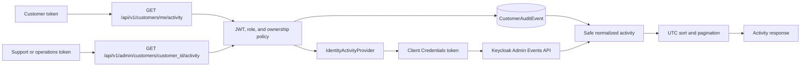

# Customer Activity Visibility

Customer activity is a presentation assembled from two independently owned records. It does not copy authentication events into the customer database and does not treat operational logs as audit records.

## Record ownership

`CustomerAuditEvent` is the append-only customer-domain record for profile provisioning, profile and address changes, and governed account administration. PostgreSQL remains its source of truth. The explicit `/audit-history` endpoints expose this domain record to the same authorized audiences without implying that it is an authentication log.

Keycloak remains the source of truth for registration, login, logout, credential, session, and identity-administration events. Customer-service queries the real Keycloak event stores through a source-neutral provider contract. It does not simulate identity events, persist them, or reproduce Keycloak's raw Admin API representation.

The merged `/activity` endpoints return only:

- UTC `timestamp`;
- stable `event_category`, `action`, `source`, and `result` values; and
- allow-listed context such as customer-domain correlation and entity identifiers or the public Keycloak client identifier.

IP addresses, usernames, email addresses, session identifiers, raw event details, tokens, credentials, administrator identifiers, and Keycloak client secrets are excluded. Unknown Keycloak event types are ignored until an explicit safe mapping is reviewed.

## Authorization and pagination

| Actor | Visibility |
| --- | --- |
| `customer` | Activity for the profile resolved from the caller's verified Keycloak `sub`; no customer identifier is accepted from the caller. |
| `support` | Read-only activity for a specified existing customer profile. |
| `operations_admin` | The same activity visibility plus separately governed customer account operations. |

Both merged endpoints validate `offset` and `limit`; merged ordering is newest first. The PoC caps activity offsets to bound upstream reads. If Keycloak is unavailable or rejects the dedicated reader, the merged endpoint returns a safe `503`. Domain audit history remains independently available through `/audit-history`.

## Keycloak access trade-off

The confidential `shopsphere-customer-activity-reader` service account receives only the `realm-management/view-events` client role. Interactive, direct-access, and browser flows are disabled. Its generated client secret is reconciled into the `shopsphere-apps/shopsphere-customer-activity-keycloak` Kubernetes Secret and injected at runtime; no value is committed or printed.

This pull-based PoC makes customer activity dependent on Keycloak availability and spends a client-credentials exchange per request. It is acceptable for the single-node demonstration but increases the blast radius of customer-service: compromise of the workload could read retained realm events. Network restriction, secret rotation, short timeouts, rate limiting, audit access monitoring, and keeping `manage-events`, `view-users`, and `realm-admin` absent are required controls.

Production evolution should export an allow-listed identity-event projection to a durable, privacy-governed audit pipeline. That projection should use workload identity or a rotated external secret, immutable retention, duplicate handling, monitored access, bounded data fields, and availability independent of the interactive identity provider. Keycloak remains the authentication source of truth.

## Validation boundary

The current live platform check confirmed Keycloak event recording, the dedicated activity-reader client, successful event querying, and absence of `manage-events` and `realm-admin`. Customer-service is deployed and Ready. The normalization, merged pagination, authorization, and Keycloak-unavailable tests exist, but their service test run did not complete and the live integration suite was skipped. The merged `/activity` journey is implemented but not claimed as end-to-end verified.
