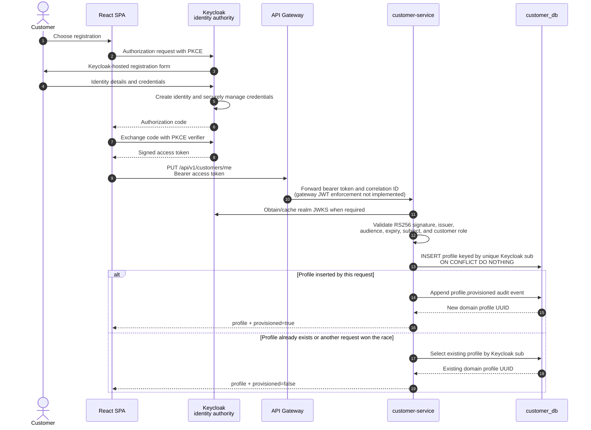

# Customer Registration and Profile Provisioning Sequence

This sequence refines [ADR-005](../../adr/ADR-005-keycloak-identity-rbac.md). Keycloak owns registration, credentials, authentication, sessions, and tokens. Customer-service owns the domain profile and provisions it from a verified identity without receiving a password or storing a token.

## Implemented boundary

Keycloak self-registration and the realm/client security baseline are implemented in the PoC platform. Customer-service implements JWT validation, the idempotent `PUT /api/v1/customers/me` provisioning operation, database uniqueness on `identity_provider_subject`, concurrency-safe insert-or-read behavior, and a single transactional provisioning audit event.

React OIDC integration and API-gateway customer routing are implemented in source. PostgreSQL, Keycloak, customer-service, and API Gateway are deployed, but the frontend is not deployed in the PoC cluster. The retained integration JUnit report contains seven skips, and the customer-service test run did not complete during the current review. The complete browser-to-service sequence is therefore not claimed as executed or functionally validated.

The Keycloak `sub` claim is the immutable external identity reference. CustomerProfile retains its own UUID. Email is copied only when a profile is first created; a later email claim for the same `sub` neither creates another profile nor silently overwrites customer-managed domain data. Explicit synchronization or reconciliation policy is a future integration concern.

No credential, password, access token, refresh token, authorization code, or PKCE verifier is persisted by customer-service or written to its audit metadata.
