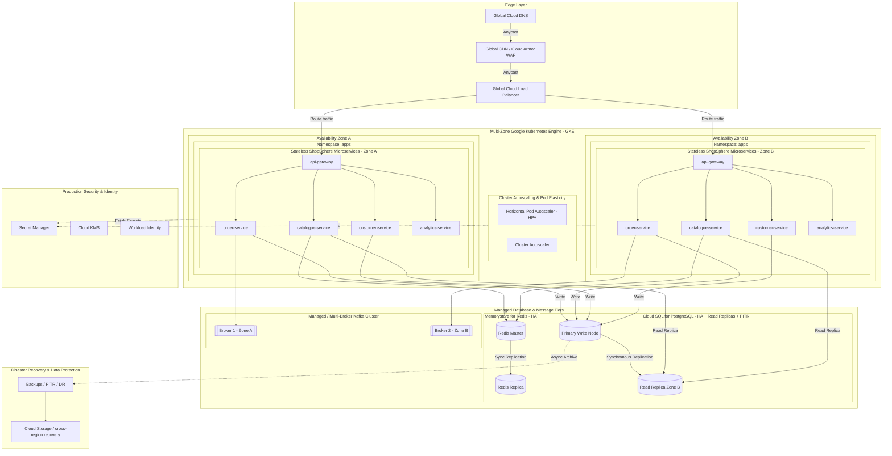
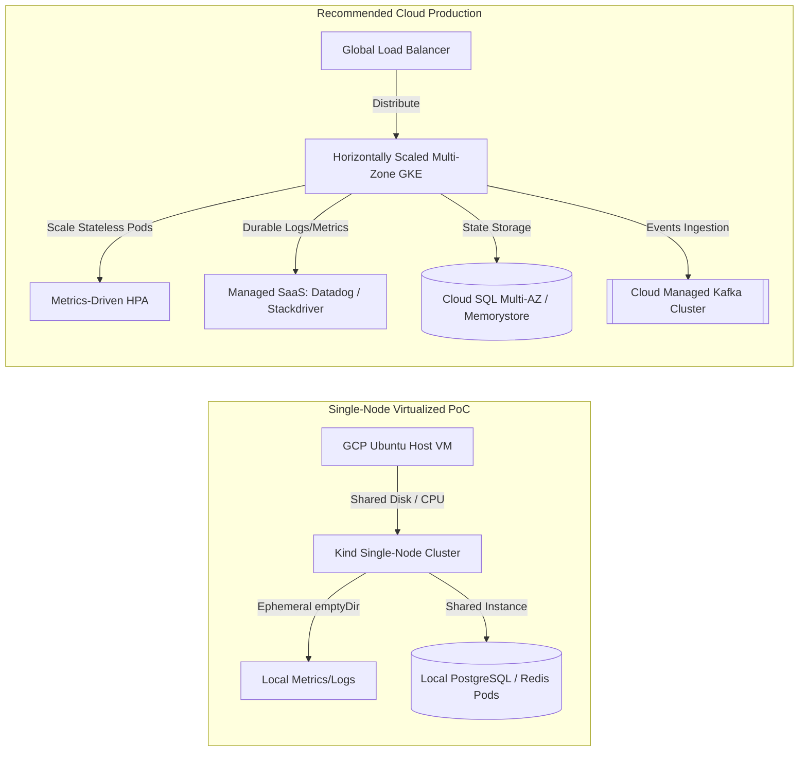

# Recommended Production Architecture (Diagrams 16–17)

> **CRITICAL ARCHITECTURAL WARNING**
>
> **THE DIAGRAMS IN THIS DOCUMENT DESCRIBE A RECOMMENDED PRODUCTION-REFERENCE ARCHITECTURE.**
> **THIS ARCHITECTURE IS NOT IMPLEMENTED IN THE POC ENVIRONMENT.**

This document provides a professional, cloud-scale architecture design for ShopSphere Global, highlighting how the platform scales to support millions of concurrent users across multiple availability zones.

---

## Diagram 16: Recommended Production Enterprise Architecture Diagram

### Purpose
Exposes the horizontally scalable, highly available, and cloud-replicated production blueprint for ShopSphere.

### Mermaid Diagram

### Accompanying Metadata
*   **Main Components:** CDN, WAF, Global Load Balancer, Multi-Zone GKE cluster, horizontally scaled stateless microservice pods, managed PostgreSQL with replication, managed Redis, multi-broker Kafka, and multi-zone failover.
*   **Key Flow:** Global traffic enters the edge layer, filters through WAF, maps to availability zones, and hits stateless gateways. Stateless microservices scale dynamically via HPAs based on traffic signals, routing writes to PostgreSQL Primary and reads to secondary replicas.
*   **Architecture Decisions:** Adopted Google Cloud SQL Multi-AZ PostgreSQL and Memorystore Redis clusters to completely decouple operations from local storage failures and provide high-durability persistence.
*   **Production Recommendations:** Maintain complete isolation of the telemetry tier (observability metrics/logs) on a separate infrastructure to prevent commerce node starvation.
*   **Viva Talking Points:** "How does this scale to millions? By keeping microservices entirely stateless, we can scale pods horizontally across multiple availability zones using HPA, while offloading state management to highly scalable, managed cloud databases."

---

## Diagram 17: PoC vs Production Comparison Diagram

### Purpose
Exposes a side-by-side technical comparison between the single-node virtualized PoC environment and the recommended cloud production architecture.

### Mermaid Diagram

### Accompanying Metadata
*   **Main Components:** Single-node Kind cluster layout (PoC) vs. Multi-Zone GKE, Global LB, managed datastores, and SaaS telemetry stack (Production).
*   **Key Flow:** Compares single-host resource-competing execution with distributed, zone-isolated, and scalable cloud processing.
*   **Architecture Decisions:** Selected Cloud SQL, Memorystore, and Managed Kafka to minimize SRE operational overhead and guarantee high-replicated data durability.
*   **Viva Talking Points:** "What is the primary difference? The PoC runs as a single process group sharing CPU, Memory, and Disk on a single GCP VM, constituting a unified failure domain. The Recommended Production Architecture is fully distributed across multiple availability zones, guaranteeing high availability, horizontal scaling, and complete disaster recovery."
