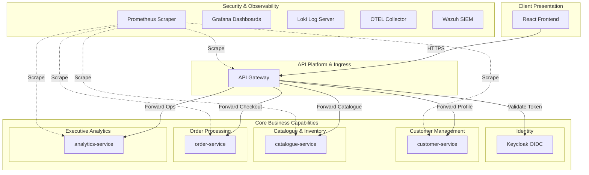
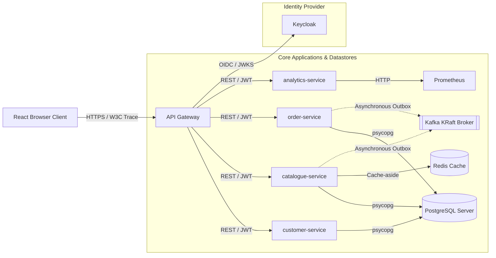
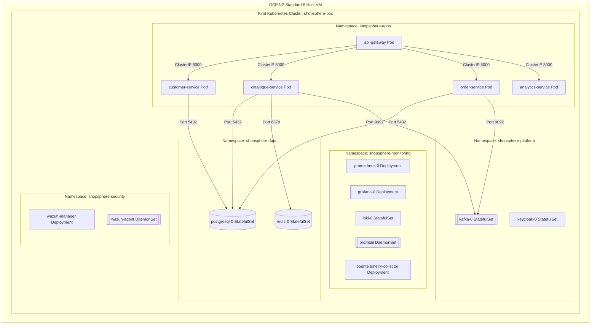
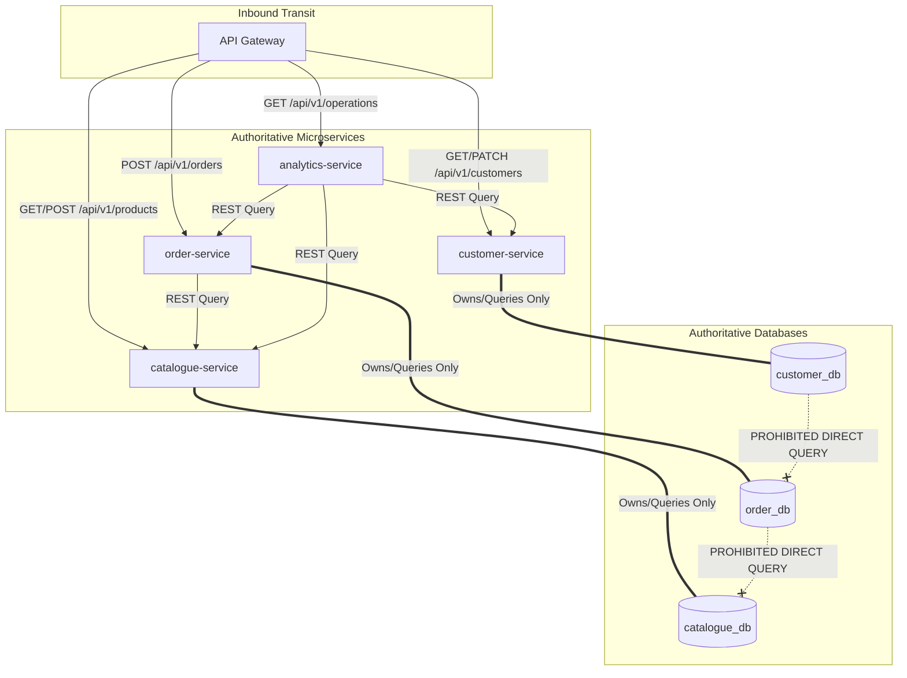
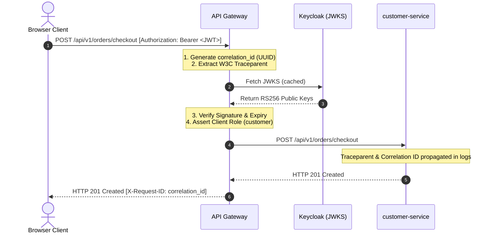

# ShopSphere System Architecture Maps (Diagrams 1–5)

This document contains the core structural maps of the ShopSphere Global Enterprise Order Management Platform, representing the actual implemented single-node PoC cluster.

---

## Diagram 1: Enterprise Software Architecture Diagram

### Purpose
Provides a holistic view of the major business capabilities of the ShopSphere platform, mapping them to their technical ownership layers.

### Mermaid Diagram

### Accompanying Metadata
*   **Main Components:** React frontend, API Gateway, 4 active backend microservices (Customer, Catalogue, Order, Analytics), Keycloak IAM, and 5 observability/security utilities.
*   **Key Flow:** Browsers hit the API Gateway, which delegates identity checks to Keycloak before proxying commerce calls to backend owners.
*   **Architecture Decisions:** Separated Customer profile sync from Keycloak OIDC login scopes (ADR-005) to ensure database schemas never hold credential tables.
*   **PoC Limitations:** Single-node host shares resources across all layers, causing performance contention under parallel quality pipelines.
*   **Viva Talking Points:** "How do we prevent customer profile replication errors? We enforce profile-sync at first login via idempotent PUT calls from the client, keyed only by Keycloak's validated sub."

---

## Diagram 2: High-Level Solution Architecture Diagram

### Purpose
Maps the technical relationships, protocols, and datastores connecting the React frontend, API Gateway, and backend microservices.

### Mermaid Diagram

### Accompanying Metadata
*   **Main Components:** React Single Page App, API Gateway, microservices, Keycloak, PostgreSQL (shared instance, isolated logical DBs), Redis, and Kafka KRaft.
*   **Key Flow:** API Gateway validates the incoming JWT against Keycloak JWKS, propagates correlation headers, and forwards requests. Catalogue-service leverages Redis cache-aside (ADR-006) for fast availability checks.
*   **Architecture Decisions:** Retained KRaft single-broker Kafka (ADR-007) to remove ZooKeeper and simplify single-node Kind orchestration.
*   **PoC Limitations:** Databases share a single PostgreSQL StatefulSet failure domain.
*   **Viva Talking Points:** "We enforce transactional outbox publishing on Catalogue and Order services (ADR-011) to ensure at-least-once message delivery to Kafka without risking two-phase commit overhead on a shared database server."

---

## Diagram 3: Detailed System Architecture Diagram

### Purpose
Details the physical container layout, namespaces, and virtual networking of the deployed `kind-shopsphere-poc` Kubernetes cluster.

### Mermaid Diagram

### Accompanying Metadata
*   **Main Components:** 5 isolated Kubernetes namespaces (`shopsphere-apps`, `shopsphere-data`, `shopsphere-platform`, `shopsphere-monitoring`, `shopsphere-security`) hosted on an Ubuntu GCP VM.
*   **Key Flow:** Pods communicate exclusively via secure, internal ClusterIP services. External traffic is locked down via host firewall mappings.
*   **Architecture Decisions:** Bound all databases and core services to internal ClusterIP-only networks to prevent public cloud exposure.
*   **PoC Limitations:** Host virtualization (Docker-in-Docker kind node) isolates the Wazuh DaemonSet from native host-level VM processes.
*   **Viva Talking Points:** "How do we isolate namespaces? We apply custom NetworkPolicies (e.g. `analytics-service-ingress`) to restrict cross-namespace traffic strictly to approved ports and pods."

---

## Diagram 4: Microservices Architecture Diagram

### Purpose
Highlights the API boundaries, system-to-service communication paths, and transactional state ownership.

### Mermaid Diagram

### Accompanying Metadata
*   **Main Components:** API Gateway, 4 microservice boundaries, 3 logically isolated database state boundaries.
*   **Key Flow:** Microservices own their databases exclusively. The `order-service` must query `catalogue-service` over secure REST APIs to revalidate prices and reserve inventory; direct cross-database queries are strictly prohibited (ADR-001).
*   **Architecture Decisions:** Enforced complete database decoupling. Each service uses dedicated SQLAlchemy engines and separate migration graphs (Alembic).
*   **PoC Limitations:** Logical databases share a single PostgreSQL master node.
*   **Viva Talking Points:** "Why can't order-service read catalogue_db directly? Direct queries break domain encapsulation, couple service schemas permanently, and bypass localized cache-aside optimizations (Redis)."

---

## Diagram 5: API Gateway Architecture Diagram

### Purpose
Exposes the ingress security loop, Bearer token validations, and headers propagation logic of the gateway.

### Mermaid Diagram

### Accompanying Metadata
*   **Main Components:** FastAPI APIRouter proxy clients, httpx2 async forwarding clients, Keycloak JWKS cache.
*   **Key Flow:** The gateway intercepts all requests, generates a structured `correlation_id` (propagated downstream), validates JWT signatures against cached JWKS, and blocks unauthenticated requests before proxying (ADR-004).
*   **Architecture Decisions:** Selected FastAPI as a transport-only routing gateway (no embedded business logic) to maintain capability-focused service layers.
*   **PoC Limitations:** Distributed rate limiting is not implemented at the gateway level.
*   **Viva Talking Points:** "How do we prevent token forgery? The gateway intercepts the public JWT and strictly validates it against Keycloak's active JWKS certificates before forwarding, completely neutralizing forged credentials."
