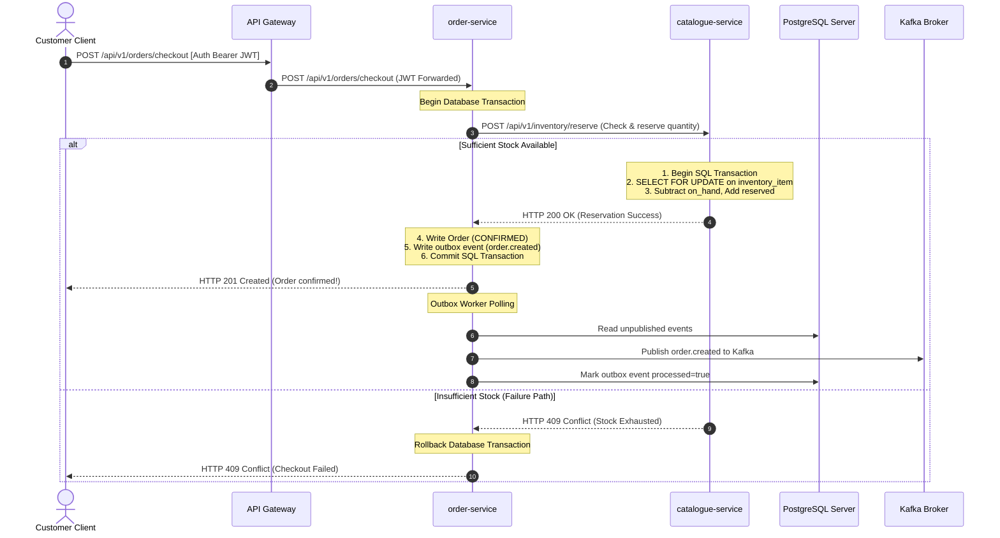
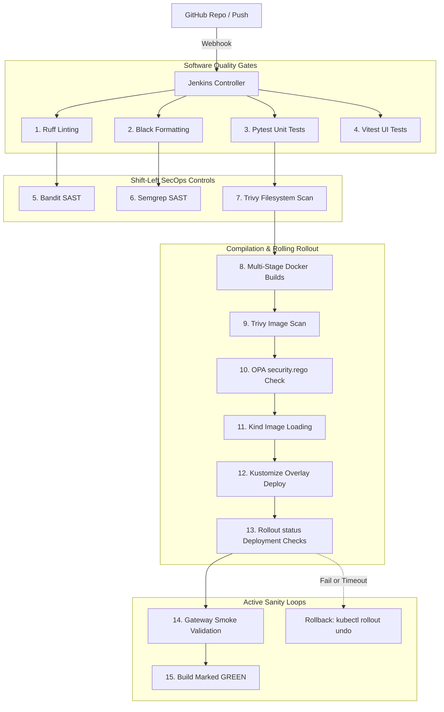
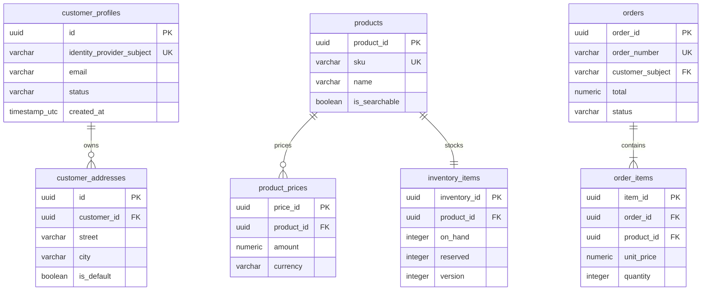

```mermaid
graph LR
    subgraph CodeGate [Source Code Security]
        S1[Black / Ruff formatting] -->|SAST| S2[Bandit Code Scan]
        S2 -->|Pattern Analysis| S3[Semgrep Monorepo Scan]
    end

    subgraph BuildGate [Supply Chain Security]
        S3 -->|SCA| S4[Trivy Filesystem Check]
        S4 -->|Container Audit| S5[Trivy Image Scan]
    end

    subgraph DeployGate [Environment Security]
        S5 -->|Admission Policy| S6[OPA security.rego Check]
        S6 -->|Privileged Pod Blocking| S7[Kustomize Validation]
    end

    subgraph RunGate [Central SIEM Audit]
        S7 -->|Deployment Ready| S8[Wazuh Agent SIEM]
        S8 -->|FIM / Anomaly Alarms| S9[Alerts Generated]
    end
```

# Workflows, Pipelines, & Database ERDs (Diagrams 12–15)

This document contains the dynamic sequence workflows, deployment/DevSecOps pipeline architectures, and database relationships of the ShopSphere Global Enterprise Platform.

---

## Diagram 12: UML Sequence Diagram – Customer Order Workflow

### Purpose
Traces the synchronous-to-asynchronous transaction states, stock safety locks, and outbox event publishing steps of a checkout flow.

### Mermaid Diagram

### Accompanying Metadata
*   **Main Components:** Customer browser, gateway, order-service, catalogue-service, PostgreSQL (logical databases), and Kafka Kraft broker.
*   **Key Flow:** Outlines both the positive reservation commit sequence and the alternate stock-exhaustion rollback sequence (ADR-011).
*   **Architecture Decisions:** Adopted the **Transactional Outbox Pattern** to decouple the HTTP request-response thread from Kafka brokers, guaranteeing that Kafka network drops never crash order creation.
*   **PoC Limitations:** Compensating transactions for partial network partitions are logged in `unresolved_reservations` rather than handled by a durable workflow coordinator.
*   **Viva Talking Points:** "How is write-safety guaranteed on checkout? Catalogue-service locks the stock row using `SELECT FOR UPDATE` during the transaction. This forces concurrent orders to wait sequentially, preventing overselling."

---

## Diagram 13: CI/CD Pipeline Architecture Diagram

### Purpose
Traces the automated, sequential pipeline stages executing under the newly upgraded 23-stage `Jenkinsfile` workflow.

### Mermaid Diagram

### Accompanying Metadata
*   **Main Components:** GitHub webhook, Jenkins Controller, Ruff, Black, Bandit, Semgrep, Trivy, OPA, Docker, Kustomize, Kind, and Smoke Tests.
*   **Key Flow:** Standard checkout $\rightarrow$ static checks (Ruff, Black) $\rightarrow$ unit testing (Pytest, Vitest) $\rightarrow$ vulnerability scanning (Bandit, Semgrep, Trivy) $\rightarrow$ policy auditing (OPA) $\rightarrow$ cluster loading and rolling status validations.
*   **Architecture Decisions:** Integrated an explicit **`post.failure`** rollback routine inside Jenkins to immediately and safely undo any failed pod rollout (`kubectl rollout undo`) before cluster state corruption.
*   **PoC Limitations:** Deployments are target-bound to a local kind cluster rather than a remote multi-environment registry.
*   **Viva Talking Points:** "How are quality gates enforced? The pipeline parses Bandit, Semgrep, Trivy, and OPA outputs. Any un-suppressed finding of `CRITICAL` or `HIGH` severity automatically returns exit code 1, aborting the build before deployment."

---

## Diagram 14: DevSecOps Pipeline Diagram

### Purpose
Exposes the specific, mapped security checkpoints and policy-as-code guards aligned with standard SecOps practices.

### Mermaid Diagram

### Accompanying Metadata
*   **Main Components:** Ruff, Bandit, Semgrep, Trivy, Open Policy Agent, and Wazuh SIEM.
*   **Key Flow:** Moves from static SAST checks (Bandit, Semgrep) $\rightarrow$ Software Supply Chain SCA (Trivy) $\rightarrow$ Admission-style Policy as Code (OPA) $\rightarrow$ active runtime SIEM host/container monitoring (Wazuh).
*   **Architecture Decisions:** Enforced **Shift-Left Security** (ADR-009). Vulnerabilities are intercepted and resolved at compile-time (Jenkins) before they ever reach running pods.
*   **PoC Limitations:** OPA checks evaluate rendered files statically in Jenkins rather than acting as a dynamic Kubernetes Admission Controller.
*   **Viva Talking Points:** "What is OPA's role? OPA acts as our policy-as-code gatekeeper. It parses flattened manifests and strictly blocks deployments containing dangerous anti-patterns, such as `privileged: true` or root containers."

---

## Diagram 15: Database ERD

### Purpose
Illustrates the physical PostgreSQL database models, data types, index constraints, and logical service divisions.

### Mermaid Diagram

### Accompanying Metadata
*   **Main Components:** Customer schemas, Catalogue/Inventory schemas, and Order schemas.
*   **Key Flow:** Data types enforce strict mathematical guarantees: `numeric` is utilized for prices (`product_prices.amount`, `order_items.unit_price`, and `orders.total`) and optimistic locks (`inventory_items.version`) prevent write collisions.
*   **Architecture Decisions:** Databases are **logically completely isolated**. No foreign keys exist across customer, catalogue, or order tables (ADR-001). They share a single physical Postgres instance solely for resource conservation in the PoC environment (ADR-002).
*   **PoC Limitations:** Sharing one Postgres server represents a unified physical failure domain.
*   **Viva Talking Points:** "How is cross-service data reference handled without foreign keys? We use stable UUID strings (e.g. `orders.customer_subject` mapped to Keycloak ID, or `order_items.product_id` mapped to Catalogue IDs) to maintain logical joins in code."
